# gRPC-Go 项目架构分析文档

## 📚 文档概述

本文档集合提供了 gRPC-Go 项目的全面架构分析，涵盖了从整体设计到具体模块实现的详细技术文档。每个文档都深入分析了相应模块的设计理念、核心实现、使用方法和最佳实践。

## 🗂️ 文档目录

### 1. 整体架构
- **[架构概览](architecture-overview.md)** - gRPC-Go 项目的整体架构设计和模块划分
- **[整体架构图](grpc-go-architecture.puml)** - PlantUML 格式的基础架构图
- **[全面系统架构图](grpc-go-comprehensive-architecture.puml)** - 完整的分层架构与设计模式分析

### 2. 核心组件

#### 客户端和服务端
- **[客户端连接管理](client-connection.md)** - ClientConn 的设计与实现
  - **[架构图](modules-client-connection-architecture.puml)** - 客户端连接管理架构图
  - **[代码位置图](modules-client-connection-code-locations.puml)** - 代码实现位置标记
- **[服务端实现](server-implementation.md)** - gRPC Server 的架构与功能
  - **[架构图](modules-server-implementation-architecture.puml)** - 服务端实现架构图
  - **[代码位置图](modules-server-implementation-code-locations.puml)** - 代码实现位置标记

#### 网络和传输
- **[传输层实现](transport-layer.md)** - HTTP/2 传输层的深度分析
  - **[架构图](modules-transport-layer-architecture.puml)** - 传输层实现架构图
  - **[代码位置图](modules-transport-layer-code-locations.puml)** - 代码实现位置标记
- **[负载均衡机制](load-balancing.md)** - 负载均衡策略与实现
  - **[架构图](modules-load-balancing-architecture.puml)** - 负载均衡机制架构图
  - **[代码位置图](modules-load-balancing-code-locations.puml)** - 代码实现位置标记
- **[服务发现系统](service-discovery.md)** - Resolver 系统的设计与使用
  - **[架构图](modules-service-discovery-architecture.puml)** - 服务发现系统架构图
  - **[代码位置图](modules-service-discovery-code-locations.puml)** - 代码实现位置标记

#### 安全和元数据
- **[认证授权系统](authentication-authorization.md)** - 安全机制的完整分析
  - **[架构图](modules-authentication-authorization-architecture.puml)** - 认证授权系统架构图
  - **[代码位置图](modules-authentication-authorization-code-locations.puml)** - 代码实现位置标记
- **[元数据处理](metadata-handling.md)** - 元数据传播与管理
  - **[架构图](modules-metadata-handling-architecture.puml)** - 元数据处理架构图
  - **[代码位置图](modules-metadata-handling-code-locations.puml)** - 代码实现位置标记

### 3. 中间件和处理机制
- **[拦截器机制](interceptor-system.md)** - 中间件系统的设计与实现
  - **[架构图](modules-interceptor-system-architecture.puml)** - 拦截器机制架构图
- **[状态码和错误处理](status-error-handling.md)** - 错误处理机制分析
  - **[架构图](modules-status-error-handling-architecture.puml)** - 状态码和错误处理架构图

### 4. 编码和序列化
- **[编码解码系统](encoding-system.md)** - 消息序列化与压缩
  - **[架构图](modules-encoding-system-architecture.puml)** - 编码解码系统架构图
  - **[代码位置图](modules-encoding-system-code-locations.puml)** - 代码实现位置标记

### 5. 扩展功能（规划中）
- **健康检查服务** - 服务健康监控
- **服务反射机制** - 动态服务发现
- **可观测性系统** - Channelz 监控与调试
- **xDS 协议支持** - 服务网格集成

## 🎯 文档特色

### 📖 深度分析
- **架构设计理念** - 分析设计决策和权衡考虑
- **核心实现逻辑** - 深入源码解析关键算法
- **接口和抽象** - 详细说明核心接口设计
- **性能优化策略** - 分析性能优化技术

### 🔧 实用指导
- **使用示例** - 提供完整的代码示例
- **最佳实践** - 总结生产环境经验
- **配置优化** - 推荐的配置参数
- **错误处理** - 常见问题和解决方案

### 📊 可视化展示
- **架构图表** - 使用 Mermaid 和 PlantUML 绘制
- **流程图** - 清晰展示交互流程
- **状态图** - 描述组件状态变化
- **时序图** - 展示调用时序关系

## 🚀 快速开始

### 推荐阅读顺序

1. **初学者路径**
   ```
   架构概览 → 客户端连接管理 → 服务端实现 → 传输层实现
   ```

2. **进阶开发者路径**
   ```
   负载均衡机制 → 服务发现系统 → 拦截器机制 → 状态码和错误处理
   ```

3. **架构师路径**
   ```
   架构概览 → 架构图 → 所有核心组件文档
   ```

### 文档使用建议

- **理论结合实践** - 阅读文档的同时运行示例代码
- **对比源码** - 结合 gRPC-Go 源码加深理解
- **实际应用** - 在项目中应用学到的最佳实践
- **持续更新** - 关注 gRPC-Go 的版本更新

## 🔍 文档导航

### 按功能分类

#### 🌐 网络通信
- [传输层实现](transport-layer.md) - HTTP/2 协议实现
- [客户端连接管理](client-connection.md) - 连接池和状态管理
- [服务端实现](server-implementation.md) - 服务监听和请求处理

#### ⚖️ 负载均衡
- [负载均衡机制](load-balancing.md) - 多种负载均衡策略
- [服务发现系统](service-discovery.md) - 动态服务端点发现

#### 🔐 安全和元数据
- [认证授权系统](authentication-authorization.md) - TLS、OAuth、ALTS 等
- [元数据处理](metadata-handling.md) - 元数据传播与管理

#### 🔧 中间件和错误处理
- [拦截器机制](interceptor-system.md) - 中间件系统设计
  - **[架构图](modules-interceptor-system-architecture.puml)** - 拦截器机制架构图
  - **[代码位置图](modules-interceptor-system-code-locations.puml)** - 代码实现位置标记
- [状态码和错误处理](status-error-handling.md) - 错误处理机制
  - **[架构图](modules-status-error-handling-architecture.puml)** - 状态码和错误处理架构图
  - **[代码位置图](modules-status-error-handling-code-locations.puml)** - 代码实现位置标记

#### 🏗️ 架构设计
- [架构概览](architecture-overview.md) - 整体设计理念
- [架构图](grpc-go-architecture.puml) - 可视化架构展示

### 按难度分级

#### 🟢 基础级别
- 架构概览
- 客户端连接管理
- 服务端实现

#### 🟡 中级级别
- 传输层实现
- 元数据处理
- 负载均衡机制
- 拦截器机制

#### 🔴 高级级别
- 服务发现系统
- 认证授权系统
- 状态码和错误处理
- 架构图分析

## 📈 学习路径建议

### 1. gRPC 新手

```mermaid
graph LR
    A[架构概览] --> B[客户端连接]
    B --> C[服务端实现]
    C --> D[基础示例实践]
```


### 2. 有经验开发者

```mermaid
graph LR
    A[传输层实现] --> B[负载均衡]
    B --> C[服务发现]
    C --> D[高级特性应用]
```


### 3. 系统架构师

```mermaid
graph LR
    A[完整架构分析] --> B[性能优化]
    B --> C[安全设计]
    C --> D[生产部署]
```


## 🛠️ 实践建议

### 环境准备
```bash
# 克隆 gRPC-Go 源码
git clone https://github.com/grpc/grpc-go.git

# 安装依赖
go mod tidy

# 运行示例
cd examples/helloworld
go run greeter_server/main.go
go run greeter_client/main.go
```

### 调试技巧
- 启用 gRPC 日志：`export GRPC_GO_LOG_VERBOSITY_LEVEL=99`
- 使用 Channelz：`import _ "google.golang.org/grpc/channelz/service"`
- 网络抓包：使用 Wireshark 分析 HTTP/2 流量

## 📝 贡献指南

### 文档改进
- 发现错误或不准确的内容
- 补充缺失的技术细节
- 提供更好的示例代码
- 改进图表和可视化

### 反馈渠道
- 通过 Issue 报告问题
- 提交 Pull Request 改进文档
- 分享使用经验和最佳实践

## 📚 参考资源

### 官方资源
- [gRPC 官方文档](https://grpc.io/docs/)
- [gRPC-Go GitHub](https://github.com/grpc/grpc-go)
- [Protocol Buffers](https://developers.google.com/protocol-buffers)

### 相关标准
- [HTTP/2 RFC 7540](https://tools.ietf.org/html/rfc7540)
- [gRPC over HTTP/2](https://github.com/grpc/grpc/blob/master/doc/PROTOCOL-HTTP2.md)
- [gRPC Authentication](https://grpc.io/docs/guides/auth/)

---

**注意**: 本文档集合基于 gRPC-Go 的当前版本进行分析，随着项目的发展，部分内容可能需要更新。建议结合最新的源码和官方文档使用。
