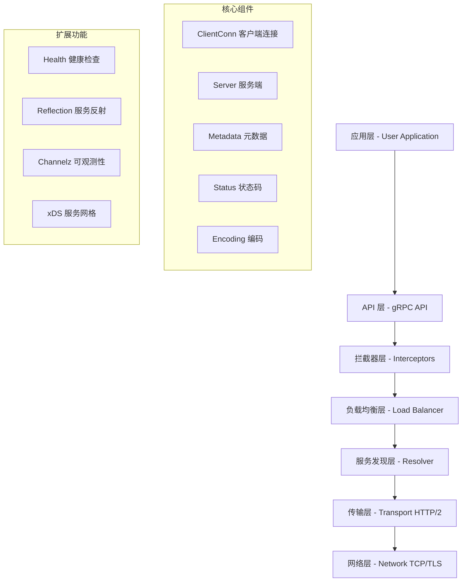
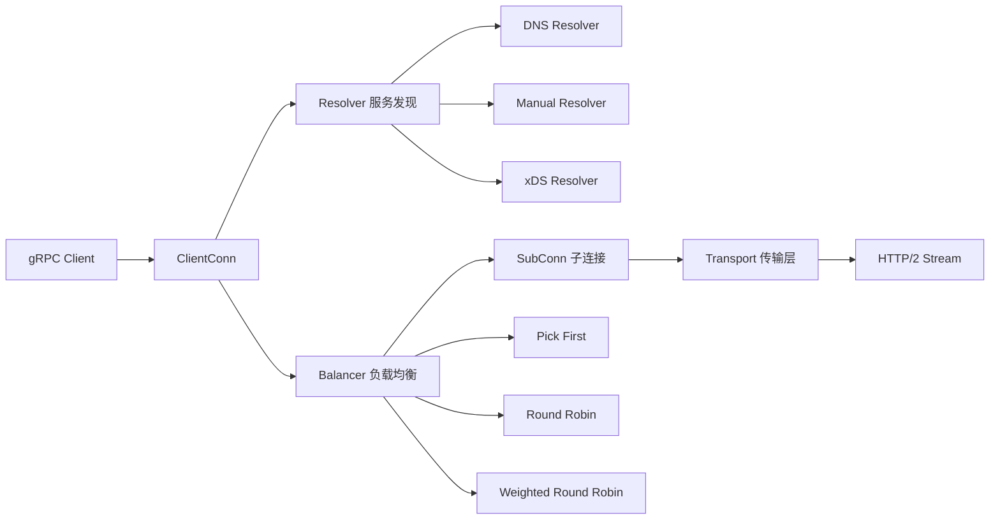
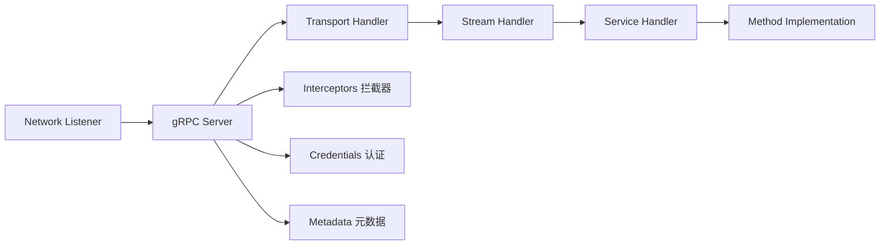
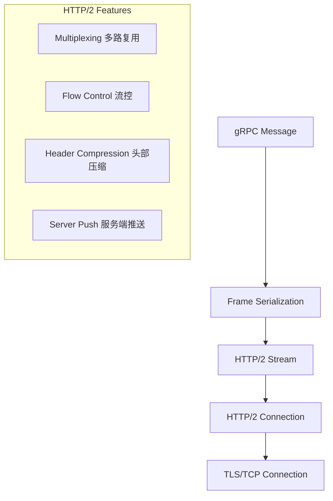
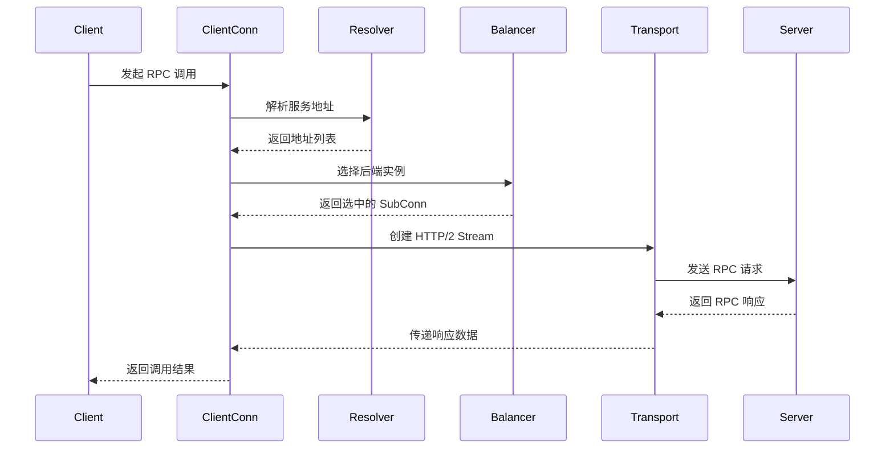
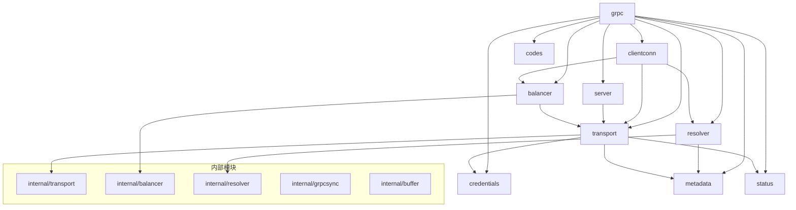

# gRPC-Go 项目整体架构概览

## 📖 概述

gRPC-Go 是 Google 开源的高性能 RPC 框架 gRPC 的 Go 语言实现。它基于 HTTP/2 协议，使用 Protocol Buffers 作为接口定义语言和消息序列化格式，提供了完整的客户端和服务端 RPC 解决方案。

## 🏗️ 整体架构设计

gRPC-Go 采用分层架构设计，从上到下包含以下核心层次：

## 🔧 核心模块架构

### 1. 客户端架构 (Client-Side)

**核心组件职责：**
- **ClientConn**: 管理到服务端的虚拟连接，处理连接状态和配置
- **Resolver**: 负责服务发现，将服务名解析为具体的网络地址
- **Balancer**: 实现负载均衡策略，选择合适的后端服务实例
- **SubConn**: 管理到单个后端的实际网络连接
- **Transport**: 处理底层 HTTP/2 协议通信

### 2. 服务端架构 (Server-Side)

**核心组件职责：**
- **Server**: 管理服务端生命周期，处理连接接受和请求分发
- **Transport Handler**: 处理 HTTP/2 传输层协议
- **Stream Handler**: 管理 RPC 流的生命周期
- **Service Handler**: 路由请求到具体的服务方法实现

### 3. 传输层架构 (Transport Layer)

## 🔄 关键交互流程

### RPC 调用流程

## 📦 模块依赖关系

## 🎯 设计模式和架构决策

### 1. 插件化架构
- **Resolver 插件**: 支持多种服务发现机制 (DNS, Manual, xDS)
- **Balancer 插件**: 支持多种负载均衡策略
- **Credentials 插件**: 支持多种认证方式
- **Encoding 插件**: 支持多种编码格式

### 2. 中间件模式
- **拦截器链**: 支持多个拦截器的链式调用
- **可组合性**: 拦截器可以独立开发和组合使用

### 3. 状态机模式
- **连接状态管理**: ClientConn 使用状态机管理连接生命周期
- **传输状态管理**: Transport 层使用状态机管理 HTTP/2 连接状态

### 4. 观察者模式
- **状态变化通知**: 连接状态变化通过回调函数通知上层
- **配置更新**: 服务配置变化通过观察者模式传播

### 5. 工厂模式
- **Builder 模式**: Resolver、Balancer 等组件使用 Builder 模式创建
- **注册机制**: 全局注册表管理各种插件的创建工厂

## 🔧 关键技术特性

### 1. 高性能特性
- **HTTP/2 多路复用**: 单连接支持多个并发 RPC 调用
- **流控制**: 防止快速发送方压垮慢速接收方
- **连接池**: 复用连接减少建连开销
- **零拷贝**: 使用 mem.BufferSlice 减少内存拷贝

### 2. 可靠性特性
- **自动重连**: 连接断开时自动重新建立连接
- **健康检查**: 主动检测后端服务健康状态
- **超时控制**: 支持请求级别的超时控制
- **错误重试**: 支持可配置的重试策略

### 3. 可扩展性特性
- **插件化设计**: 核心组件支持插件扩展
- **中间件支持**: 拦截器机制支持横切关注点
- **配置驱动**: 支持动态配置更新

### 4. 可观测性特性
- **Channelz**: 提供连接和 RPC 调用的详细监控信息
- **Metrics**: 支持 Prometheus 等监控系统集成
- **Tracing**: 支持分布式链路追踪
- **Logging**: 结构化日志记录

## 📊 性能优化策略

### 1. 内存管理优化
- **对象池**: 复用频繁创建的对象
- **缓冲区管理**: 使用 mem 包管理缓冲区
- **避免内存拷贝**: 使用 BufferSlice 实现零拷贝

### 2. 网络优化
- **连接复用**: HTTP/2 连接多路复用
- **批量处理**: 批量发送和接收数据
- **压缩**: 支持 gzip 等压缩算法

### 3. 并发优化
- **无锁设计**: 关键路径避免锁竞争
- **协程池**: 复用 goroutine 减少创建开销
- **异步处理**: 非阻塞的异步操作

## 🔮 未来发展方向

1. **云原生集成**: 更好的 Kubernetes 和服务网格集成
2. **性能优化**: 持续的性能优化和内存使用优化
3. **协议扩展**: 支持更多的传输协议和编码格式
4. **可观测性增强**: 更丰富的监控和调试功能
5. **安全性增强**: 更强的安全特性和合规性支持

---

本文档提供了 gRPC-Go 项目的整体架构概览。后续文档将深入分析各个核心模块的具体实现和使用方法。
