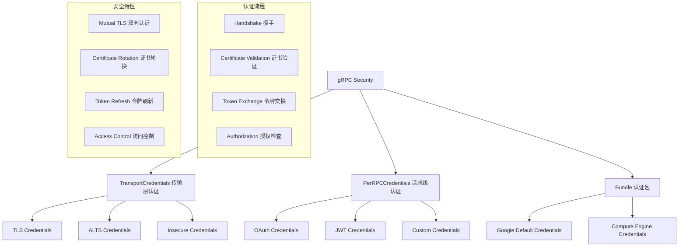

# 认证授权系统 (Authentication & Authorization) 深度分析

## 📖 概述

gRPC-Go 提供了完整的认证授权框架，支持传输层安全（TLS）、应用层认证（OAuth、JWT）、以及 Google 云平台的 ALTS 等多种认证机制。该系统通过 Credentials 接口抽象不同的认证方式，为 gRPC 通信提供端到端的安全保障。

## 🏗️ 核心架构

### 认证系统架构



### 关键接口定义

<augment_code_snippet path="credentials/credentials.go" mode="EXCERPT">
````go
// TransportCredentials defines the common interface for all the live gRPC wire
// protocols and supported transport security protocols (e.g., TLS, SSL).
type TransportCredentials interface {
    // ClientHandshake does the authentication handshake specified by the
    // corresponding authentication protocol on rawConn for clients.
    ClientHandshake(context.Context, string, net.Conn) (net.Conn, AuthInfo, error)
    // ServerHandshake does the authentication handshake for servers.
    ServerHandshake(net.Conn) (net.Conn, AuthInfo, error)
    // Info provides the ProtocolInfo of this TransportCredentials.
    Info() ProtocolInfo
    // Clone makes a copy of this TransportCredentials.
    Clone() TransportCredentials
    // OverrideServerName overrides the server name used to verify the hostname.
    OverrideServerName(string) error
}

// PerRPCCredentials defines the common interface for the credentials which need to
// attach security information to every RPC (e.g., oauth2).
type PerRPCCredentials interface {
    // GetRequestMetadata gets the current request metadata, refreshing tokens if required.
    GetRequestMetadata(ctx context.Context, uri ...string) (map[string]string, error)
    // RequireTransportSecurity indicates whether the credentials requires transport security.
    RequireTransportSecurity() bool
}
````
</augment_code_snippet>

## 🔐 传输层认证 (Transport Credentials)

### 1. TLS 认证

**特点：**
- 基于 X.509 证书的身份验证
- 支持单向和双向 TLS
- 提供传输层加密
- 支持证书链验证

```go
// 客户端 TLS 配置
func createClientTLSCredentials() credentials.TransportCredentials {
    config := &tls.Config{
        ServerName: "your-service.com",
        // 可选：客户端证书（双向 TLS）
        Certificates: []tls.Certificate{clientCert},
        // 可选：自定义根 CA
        RootCAs: rootCAs,
        // 可选：跳过证书验证（仅测试环境）
        InsecureSkipVerify: false,
    }
    return credentials.NewTLS(config)
}

// 服务端 TLS 配置
func createServerTLSCredentials() credentials.TransportCredentials {
    cert, err := tls.LoadX509KeyPair("server.crt", "server.key")
    if err != nil {
        log.Fatal(err)
    }
    
    config := &tls.Config{
        Certificates: []tls.Certificate{cert},
        // 可选：要求客户端证书（双向 TLS）
        ClientAuth: tls.RequireAndVerifyClientCert,
        ClientCAs:  clientCAs,
    }
    return credentials.NewTLS(config)
}
```

### 2. ALTS 认证

**特点：**
- Google 云平台专用认证
- 基于服务身份的认证
- 自动证书管理
- 高性能加密

```go
// ALTS 客户端认证
func createALTSCredentials() credentials.TransportCredentials {
    return alts.NewClientCreds(&alts.ClientOptions{
        // 可选：目标服务账户
        TargetServiceAccounts: []string{"service@project.iam.gserviceaccount.com"},
    })
}

// ALTS 服务端认证
func createALTSServerCredentials() credentials.TransportCredentials {
    return alts.NewServerCreds(&alts.ServerOptions{
        // 可选：握手协议
        HandshakerServiceAddress: "metadata.google.internal:8080",
    })
}
```

### 3. Insecure 认证

**特点：**
- 无加密的明文传输
- 仅用于开发和测试
- 不提供任何安全保障

```go
// 不安全连接（仅测试使用）
func createInsecureCredentials() credentials.TransportCredentials {
    return insecure.NewCredentials()
}
```

## 🎫 请求级认证 (PerRPC Credentials)

### 1. OAuth 2.0 认证

```go
// OAuth 2.0 客户端认证
func createOAuthCredentials() credentials.PerRPCCredentials {
    config := &oauth2.Config{
        ClientID:     "your-client-id",
        ClientSecret: "your-client-secret",
        Scopes:       []string{"https://www.googleapis.com/auth/cloud-platform"},
        Endpoint:     google.Endpoint,
    }
    
    token := &oauth2.Token{
        AccessToken: "your-access-token",
        TokenType:   "Bearer",
    }
    
    return oauth.NewOauthAccess(config.TokenSource(context.Background(), token))
}

// 使用 OAuth 认证的客户端
func createOAuthClient() (*grpc.ClientConn, error) {
    return grpc.NewClient(serverAddr,
        grpc.WithTransportCredentials(credentials.NewTLS(&tls.Config{})),
        grpc.WithPerRPCCredentials(createOAuthCredentials()),
    )
}
```

### 2. JWT 认证

```go
// JWT 认证实现
type jwtCredentials struct {
    token string
}

func (j *jwtCredentials) GetRequestMetadata(ctx context.Context, uri ...string) (map[string]string, error) {
    return map[string]string{
        "authorization": "Bearer " + j.token,
    }, nil
}

func (j *jwtCredentials) RequireTransportSecurity() bool {
    return true // JWT 需要 TLS 保护
}

// 创建 JWT 认证
func createJWTCredentials(token string) credentials.PerRPCCredentials {
    return &jwtCredentials{token: token}
}
```

### 3. API Key 认证

```go
// API Key 认证实现
type apiKeyCredentials struct {
    key string
}

func (a *apiKeyCredentials) GetRequestMetadata(ctx context.Context, uri ...string) (map[string]string, error) {
    return map[string]string{
        "x-api-key": a.key,
    }, nil
}

func (a *apiKeyCredentials) RequireTransportSecurity() bool {
    return true
}

// 创建 API Key 认证
func createAPIKeyCredentials(key string) credentials.PerRPCCredentials {
    return &apiKeyCredentials{key: key}
}
```

## 🔧 认证包 (Credentials Bundle)

### Google Default Credentials

```go
// Google 默认认证
func createGoogleDefaultCredentials() (credentials.Bundle, error) {
    return google.NewDefaultCredentials(), nil
}

// 使用 Google 默认认证
func createGoogleClient() (*grpc.ClientConn, error) {
    creds, err := createGoogleDefaultCredentials()
    if err != nil {
        return nil, err
    }
    
    return grpc.NewClient(serverAddr,
        grpc.WithCredentialsBundle(creds),
    )
}
```

### Compute Engine Credentials

```go
// Compute Engine 认证
func createComputeEngineCredentials() credentials.Bundle {
    return google.NewComputeEngineCredentials()
}
```

## 🛡️ 高级安全特性

### 1. 双向 TLS (Mutual TLS)

```go
// 双向 TLS 配置
func setupMutualTLS() (credentials.TransportCredentials, credentials.TransportCredentials) {
    // 加载证书
    serverCert, _ := tls.LoadX509KeyPair("server.crt", "server.key")
    clientCert, _ := tls.LoadX509KeyPair("client.crt", "client.key")
    
    // 加载 CA 证书
    caCert, _ := ioutil.ReadFile("ca.crt")
    caCertPool := x509.NewCertPool()
    caCertPool.AppendCertsFromPEM(caCert)
    
    // 服务端配置
    serverConfig := &tls.Config{
        Certificates: []tls.Certificate{serverCert},
        ClientAuth:   tls.RequireAndVerifyClientCert,
        ClientCAs:    caCertPool,
    }
    
    // 客户端配置
    clientConfig := &tls.Config{
        Certificates: []tls.Certificate{clientCert},
        RootCAs:      caCertPool,
        ServerName:   "your-service.com",
    }
    
    return credentials.NewTLS(serverConfig), credentials.NewTLS(clientConfig)
}
```

### 2. 证书轮换

```go
// 动态证书轮换
type rotatableCredentials struct {
    mu       sync.RWMutex
    current  credentials.TransportCredentials
    certFile string
    keyFile  string
}

func (r *rotatableCredentials) ClientHandshake(ctx context.Context, authority string, rawConn net.Conn) (net.Conn, credentials.AuthInfo, error) {
    r.mu.RLock()
    creds := r.current
    r.mu.RUnlock()
    return creds.ClientHandshake(ctx, authority, rawConn)
}

func (r *rotatableCredentials) rotateCertificate() error {
    newCreds, err := credentials.NewServerTLSFromFile(r.certFile, r.keyFile)
    if err != nil {
        return err
    }
    
    r.mu.Lock()
    r.current = newCreds
    r.mu.Unlock()
    
    return nil
}

// 定期轮换证书
func (r *rotatableCredentials) startRotation() {
    ticker := time.NewTicker(24 * time.Hour)
    go func() {
        for range ticker.C {
            if err := r.rotateCertificate(); err != nil {
                log.Printf("Certificate rotation failed: %v", err)
            }
        }
    }()
}
```

### 3. 令牌刷新

```go
// 自动令牌刷新
type refreshableTokenCredentials struct {
    mu           sync.RWMutex
    tokenSource  oauth2.TokenSource
    currentToken *oauth2.Token
}

func (r *refreshableTokenCredentials) GetRequestMetadata(ctx context.Context, uri ...string) (map[string]string, error) {
    token, err := r.getValidToken(ctx)
    if err != nil {
        return nil, err
    }
    
    return map[string]string{
        "authorization": token.Type() + " " + token.AccessToken,
    }, nil
}

func (r *refreshableTokenCredentials) getValidToken(ctx context.Context) (*oauth2.Token, error) {
    r.mu.RLock()
    if r.currentToken != nil && r.currentToken.Valid() {
        token := r.currentToken
        r.mu.RUnlock()
        return token, nil
    }
    r.mu.RUnlock()
    
    // 需要刷新令牌
    r.mu.Lock()
    defer r.mu.Unlock()
    
    // 双重检查
    if r.currentToken != nil && r.currentToken.Valid() {
        return r.currentToken, nil
    }
    
    // 刷新令牌
    token, err := r.tokenSource.Token()
    if err != nil {
        return nil, err
    }
    
    r.currentToken = token
    return token, nil
}
```

## 🔍 授权和访问控制

### 1. 基于角色的访问控制 (RBAC)

```go
// RBAC 拦截器
func rbacInterceptor(allowedRoles []string) grpc.UnaryServerInterceptor {
    return func(ctx context.Context, req any, info *grpc.UnaryServerInfo, handler grpc.UnaryHandler) (any, error) {
        // 从上下文中提取用户信息
        userInfo, ok := getUserInfoFromContext(ctx)
        if !ok {
            return nil, status.Error(codes.Unauthenticated, "missing user information")
        }
        
        // 检查用户角色
        if !hasRequiredRole(userInfo.Roles, allowedRoles) {
            return nil, status.Error(codes.PermissionDenied, "insufficient permissions")
        }
        
        return handler(ctx, req)
    }
}

// 使用 RBAC 拦截器
func createSecureServer() *grpc.Server {
    return grpc.NewServer(
        grpc.Creds(serverTLSCreds),
        grpc.UnaryInterceptor(rbacInterceptor([]string{"admin", "user"})),
    )
}
```

### 2. 基于属性的访问控制 (ABAC)

```go
// ABAC 策略引擎
type ABACPolicy struct {
    rules []AccessRule
}

type AccessRule struct {
    Resource   string
    Action     string
    Conditions []Condition
}

type Condition struct {
    Attribute string
    Operator  string
    Value     any
}

func (p *ABACPolicy) Evaluate(ctx context.Context, resource, action string) bool {
    userAttrs := getUserAttributesFromContext(ctx)
    
    for _, rule := range p.rules {
        if rule.Resource == resource && rule.Action == action {
            if p.evaluateConditions(rule.Conditions, userAttrs) {
                return true
            }
        }
    }
    
    return false
}

// ABAC 拦截器
func abacInterceptor(policy *ABACPolicy) grpc.UnaryServerInterceptor {
    return func(ctx context.Context, req any, info *grpc.UnaryServerInfo, handler grpc.UnaryHandler) (any, error) {
        if !policy.Evaluate(ctx, info.FullMethod, "invoke") {
            return nil, status.Error(codes.PermissionDenied, "access denied by policy")
        }
        
        return handler(ctx, req)
    }
}
```

## 💡 最佳实践

### 1. 安全配置

```go
// 生产环境安全配置
func createProductionCredentials() credentials.TransportCredentials {
    config := &tls.Config{
        // 强制使用 TLS 1.2+
        MinVersion: tls.VersionTLS12,
        // 使用安全的密码套件
        CipherSuites: []uint16{
            tls.TLS_ECDHE_RSA_WITH_AES_256_GCM_SHA384,
            tls.TLS_ECDHE_RSA_WITH_CHACHA20_POLY1305,
            tls.TLS_ECDHE_ECDSA_WITH_AES_256_GCM_SHA384,
        },
        // 启用 OCSP 装订
        OCSPStapling: true,
        // 设置服务器名称
        ServerName: "your-service.com",
    }
    
    return credentials.NewTLS(config)
}
```

### 2. 错误处理

```go
// 安全错误处理
func handleAuthError(err error) error {
    switch {
    case errors.Is(err, credentials.ErrConnDispatched):
        return status.Error(codes.Internal, "connection error")
    case errors.Is(err, context.DeadlineExceeded):
        return status.Error(codes.DeadlineExceeded, "authentication timeout")
    default:
        // 不暴露具体的认证错误信息
        return status.Error(codes.Unauthenticated, "authentication failed")
    }
}
```

### 3. 监控和审计

```go
// 认证审计拦截器
func authAuditInterceptor() grpc.UnaryServerInterceptor {
    return func(ctx context.Context, req any, info *grpc.UnaryServerInfo, handler grpc.UnaryHandler) (any, error) {
        start := time.Now()
        
        // 记录认证信息
        peer, _ := peer.FromContext(ctx)
        userInfo, _ := getUserInfoFromContext(ctx)
        
        resp, err := handler(ctx, req)
        
        // 记录审计日志
        auditLog := AuditLog{
            Timestamp:    start,
            Method:       info.FullMethod,
            ClientAddr:   peer.Addr.String(),
            UserID:       userInfo.UserID,
            Success:      err == nil,
            Duration:     time.Since(start),
            ErrorCode:    status.Code(err),
        }
        
        logAuditEvent(auditLog)
        
        return resp, err
    }
}
```

---

gRPC-Go 的认证授权系统提供了全面的安全保障，理解其架构和最佳实践对于构建安全的分布式系统至关重要。
