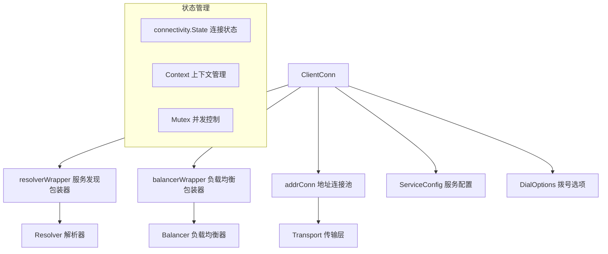
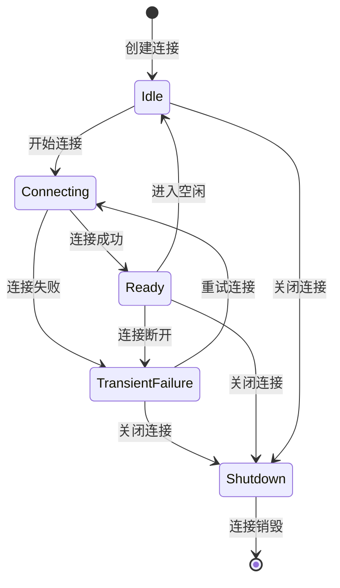
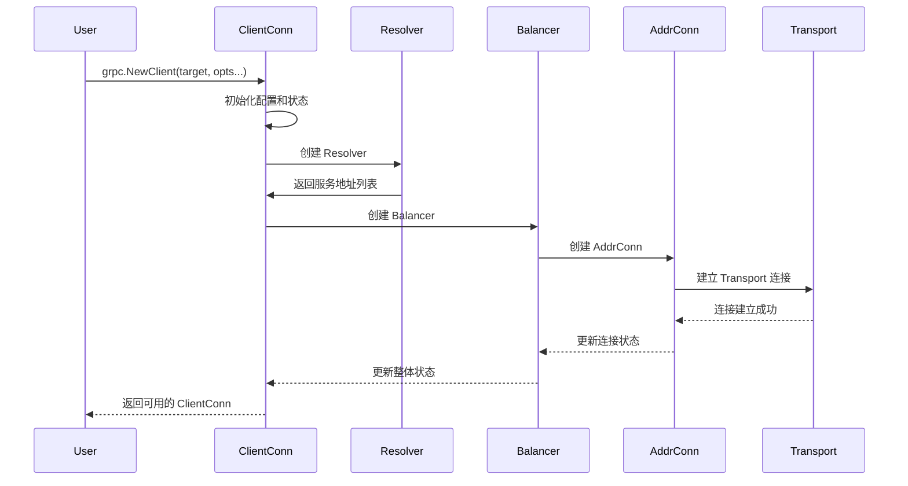
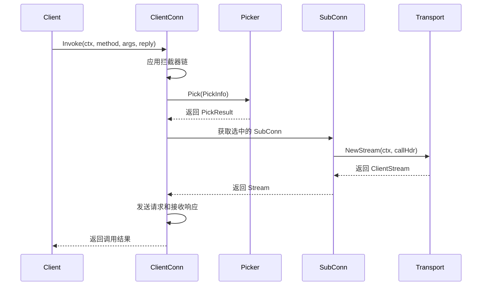

# 客户端连接管理 (ClientConn) 深度分析

## 📖 概述

ClientConn 是 gRPC-Go 客户端的核心组件，代表到一个概念端点的虚拟连接。它负责管理实际的网络连接、服务发现、负载均衡、连接状态维护等关键功能。

## 🏗️ 核心架构

### ClientConn 结构设计



### 关键数据结构

<augment_code_snippet path="clientconn.go" mode="EXCERPT">
````go
// ClientConn represents a virtual connection to a conceptual endpoint, to
// perform RPCs.
type ClientConn struct {
    ctx    context.Context    // Initialized using the background context at dial time.
    cancel context.CancelFunc // Cancelled on close.
    
    target string // The target string used to create this ClientConn
    
    // mu protects the following fields.
    mu              sync.RWMutex
    resolverWrapper *ccResolverWrapper         // Always recreated whenever entering idle
    balancerWrapper *ccBalancerWrapper         // Always recreated whenever entering idle
    sc              *ServiceConfig             // Latest service config received from the resolver
    conns           map[*addrConn]struct{}     // Set to nil on close
    keepaliveParams keepalive.ClientParameters // May be updated upon receipt of a GoAway
}
````
</augment_code_snippet>

## 🔄 连接生命周期管理

### 连接状态机



### 连接创建流程



## 🔧 核心功能实现

### 1. 服务发现集成

ClientConn 通过 resolverWrapper 集成服务发现功能：

<augment_code_snippet path="clientconn.go" mode="EXCERPT">
````go
// ccResolverWrapper is a wrapper on top of cc for resolvers.
type ccResolverWrapper struct {
    cc         *ClientConn
    resolverMu sync.Mutex
    resolver   resolver.Resolver
    done       *grpcsync.Event
    curState   resolver.State
}
````
</augment_code_snippet>

**主要职责：**
- 管理 Resolver 的生命周期
- 处理地址更新和服务配置变化
- 将解析结果传递给负载均衡器

### 2. 负载均衡集成

通过 balancerWrapper 集成负载均衡功能：

<augment_code_snippet path="clientconn.go" mode="EXCERPT">
````go
// ccBalancerWrapper is a wrapper on top of cc for balancers.
type ccBalancerWrapper struct {
    cc       *ClientConn
    balancer balancer.Balancer
    stateChangeQueue *grpcsync.CallbackSerializer
    ccUpdateCh chan *balancer.ClientConnState
}
````
</augment_code_snippet>

**主要职责：**
- 管理 Balancer 的生命周期
- 处理连接状态变化
- 提供 Picker 用于 RPC 调用时的连接选择

### 3. 地址连接管理 (AddrConn)

AddrConn 管理到单个地址的实际网络连接：

<augment_code_snippet path="clientconn.go" mode="EXCERPT">
````go
// addrConn is a network connection to a given address.
type addrConn struct {
    ctx    context.Context
    cancel context.CancelFunc
    
    cc     *ClientConn
    dopts  dialOptions
    acbw   *acBalancerWrapper
    
    transport transport.ClientTransport // The current transport
}
````
</augment_code_snippet>

**核心功能：**
- 管理单个地址的连接状态
- 处理连接重试和退避策略
- 维护 HTTP/2 传输层连接

## 🎯 RPC 调用处理

### Invoke 方法实现



### 关键代码实现

<augment_code_snippet path="call.go" mode="EXCERPT">
````go
// Invoke sends the RPC request on the wire and returns after response is
// received.  This is typically called by generated code.
func (cc *ClientConn) Invoke(ctx context.Context, method string, args, reply any, opts ...CallOption) error {
    // Apply call options
    c := defaultCallInfo()
    for _, o := range opts {
        if err := o.before(c); err != nil {
            return toRPCErr(err)
        }
    }
    
    // Apply interceptors
    return invoke(ctx, method, args, reply, cc, opts...)
}
````
</augment_code_snippet>

## ⚙️ 配置管理

### DialOptions 配置系统

gRPC-Go 使用函数式选项模式配置 ClientConn：

```go
// 常用配置选项
conn, err := grpc.NewClient(target,
    grpc.WithTransportCredentials(creds),           // 传输层认证
    grpc.WithUnaryInterceptor(unaryInterceptor),    // 一元拦截器
    grpc.WithStreamInterceptor(streamInterceptor),  // 流拦截器
    grpc.WithDefaultServiceConfig(serviceConfig),   // 默认服务配置
    grpc.WithKeepaliveParams(keepaliveParams),      // 保活参数
)
```

### 服务配置 (ServiceConfig)

服务配置支持动态更新，包括：
- 负载均衡策略配置
- 重试策略配置
- 超时配置
- 方法级别的配置覆盖

## 🔒 并发安全设计

### 锁策略

ClientConn 使用分层锁策略确保并发安全：

1. **ClientConn.mu**: 保护 ClientConn 的核心状态
2. **addrConn.mu**: 保护单个地址连接的状态
3. **无锁设计**: 在可能的情况下使用原子操作和 channel

### 状态同步


## 🚀 性能优化特性

### 1. 连接复用
- HTTP/2 多路复用：单连接支持多个并发 RPC
- 连接池管理：复用现有连接减少建连开销

### 2. 智能重连
- 指数退避策略：避免连接风暴
- 健康检查集成：快速检测连接可用性

### 3. 内存优化
- 对象池：复用频繁创建的对象
- 延迟初始化：按需创建资源

## 🔍 监控和调试

### Channelz 集成

ClientConn 集成了 Channelz 可观测性功能：

```go
// 获取连接状态信息
func (cc *ClientConn) GetState() connectivity.State {
    cc.mu.RLock()
    defer cc.mu.RUnlock()
    return cc.state
}

// 等待状态变化
func (cc *ClientConn) WaitForStateChange(ctx context.Context, sourceState connectivity.State) bool {
    // 实现状态变化等待逻辑
}
```

### 调试信息

- 连接状态历史
- 地址解析记录
- 负载均衡决策日志
- 传输层统计信息

## 💡 最佳实践

### 1. 连接管理
```go
// 推荐：复用 ClientConn
var conn *grpc.ClientConn
func init() {
    var err error
    conn, err = grpc.NewClient(target, opts...)
    if err != nil {
        log.Fatal(err)
    }
}

// 应用退出时关闭连接
defer conn.Close()
```

### 2. 错误处理
```go
// 检查连接状态
if conn.GetState() == connectivity.TransientFailure {
    // 处理连接失败情况
}

// 使用上下文控制超时
ctx, cancel := context.WithTimeout(context.Background(), time.Second)
defer cancel()
```

### 3. 配置优化
```go
// 生产环境推荐配置
conn, err := grpc.NewClient(target,
    grpc.WithTransportCredentials(credentials.NewTLS(&tls.Config{})),
    grpc.WithKeepaliveParams(keepalive.ClientParameters{
        Time:                10 * time.Second,
        Timeout:             time.Second,
        PermitWithoutStream: true,
    }),
    grpc.WithDefaultServiceConfig(`{
        "loadBalancingPolicy": "round_robin",
        "retryPolicy": {
            "maxAttempts": 3,
            "initialBackoff": "0.1s",
            "maxBackoff": "1s"
        }
    }`),
)
```

---

ClientConn 是 gRPC-Go 客户端的核心，理解其架构和实现对于高效使用 gRPC 至关重要。
