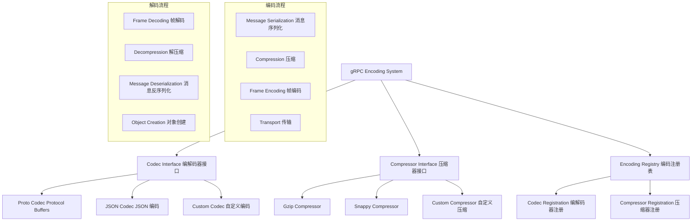

# 编码解码系统 (Encoding System) 深度分析

## 📖 概述

gRPC-Go 的编码解码系统提供了灵活的消息序列化机制，支持多种编码格式和压缩算法。该系统通过 Codec 接口抽象编码逻辑，通过 Compressor 接口实现压缩功能，为 gRPC 通信提供了高效的数据传输能力。

## 🏗️ 核心架构

### 编码系统架构



### 关键接口定义

<augment_code_snippet path="encoding/encoding.go" mode="EXCERPT">
````go
// Codec defines the interface gRPC uses to encode and decode messages.
type Codec interface {
    // Marshal returns the wire format of v.
    Marshal(v any) ([]byte, error)
    // Unmarshal parses the wire format into v.
    Unmarshal(data []byte, v any) error
    // Name returns the name of the Codec implementation.
    Name() string
}

// Compressor is used for compressing and decompressing when sending or receiving messages.
type Compressor interface {
    // Compress writes the compressed form of p to w.
    Compress(w io.Writer) (io.WriteCloser, error)
    // Decompress reads data from r, decompresses it, and provides the uncompressed data via the returned io.Reader.
    Decompress(r io.Reader) (io.Reader, error)
    // Name returns the compression algorithm the Compressor uses.
    Name() string
}
````
</augment_code_snippet>

## 🎯 内置编解码器

### 1. Protocol Buffers 编解码器

**特点：**
- gRPC 的默认编码格式
- 高效的二进制序列化
- 强类型和向后兼容
- 跨语言支持

<augment_code_snippet path="encoding/proto/proto.go" mode="EXCERPT">
````go
// codec is a Codec implementation with protobuf. It is the default codec for gRPC.
type codec struct{}

func (codec) Marshal(v any) ([]byte, error) {
    vv := messageV2Of(v)
    if vv == nil {
        return nil, fmt.Errorf("failed to marshal, message is %T, want proto.Message", v)
    }
    return proto.Marshal(vv)
}

func (codec) Unmarshal(data []byte, v any) error {
    vv := messageV2Of(v)
    if vv == nil {
        return fmt.Errorf("failed to unmarshal, message is %T, want proto.Message", v)
    }
    return proto.Unmarshal(data, vv)
}

func (codec) Name() string {
    return Name
}
````
</augment_code_snippet>

### 2. JSON 编解码器

```go
// JSON 编解码器实现
type jsonCodec struct{}

func (jsonCodec) Marshal(v any) ([]byte, error) {
    if pm, ok := v.(proto.Message); ok {
        // 使用 protojson 进行 JSON 序列化
        return protojson.Marshal(pm)
    }
    
    // 标准 JSON 序列化
    return json.Marshal(v)
}

func (jsonCodec) Unmarshal(data []byte, v any) error {
    if pm, ok := v.(proto.Message); ok {
        // 使用 protojson 进行 JSON 反序列化
        return protojson.Unmarshal(data, pm)
    }
    
    // 标准 JSON 反序列化
    return json.Unmarshal(data, v)
}

func (jsonCodec) Name() string {
    return "json"
}

// 注册 JSON 编解码器
func init() {
    encoding.RegisterCodec(&jsonCodec{})
}
```

### 3. 自定义编解码器

```go
// 自定义编解码器示例
type customCodec struct {
    name string
}

func NewCustomCodec(name string) encoding.Codec {
    return &customCodec{name: name}
}

func (c *customCodec) Marshal(v any) ([]byte, error) {
    // 实现自定义序列化逻辑
    switch msg := v.(type) {
    case *CustomMessage:
        return c.marshalCustomMessage(msg)
    case proto.Message:
        // 回退到 protobuf
        return proto.Marshal(msg)
    default:
        return nil, fmt.Errorf("unsupported message type: %T", v)
    }
}

func (c *customCodec) Unmarshal(data []byte, v any) error {
    // 实现自定义反序列化逻辑
    switch msg := v.(type) {
    case *CustomMessage:
        return c.unmarshalCustomMessage(data, msg)
    case proto.Message:
        // 回退到 protobuf
        return proto.Unmarshal(data, msg)
    default:
        return fmt.Errorf("unsupported message type: %T", v)
    }
}

func (c *customCodec) Name() string {
    return c.name
}

func (c *customCodec) marshalCustomMessage(msg *CustomMessage) ([]byte, error) {
    // 实现自定义序列化格式
    buf := make([]byte, 0, 1024)
    
    // 写入版本号
    buf = append(buf, byte(msg.Version))
    
    // 写入字符串长度和内容
    nameBytes := []byte(msg.Name)
    buf = binary.BigEndian.AppendUint32(buf, uint32(len(nameBytes)))
    buf = append(buf, nameBytes...)
    
    // 写入数值
    buf = binary.BigEndian.AppendUint64(buf, uint64(msg.Value))
    
    return buf, nil
}

func (c *customCodec) unmarshalCustomMessage(data []byte, msg *CustomMessage) error {
    if len(data) < 9 { // 最小长度：1(version) + 4(length) + 8(value)
        return fmt.Errorf("data too short")
    }
    
    offset := 0
    
    // 读取版本号
    msg.Version = int32(data[offset])
    offset++
    
    // 读取字符串长度
    nameLen := binary.BigEndian.Uint32(data[offset:])
    offset += 4
    
    if len(data) < offset+int(nameLen)+8 {
        return fmt.Errorf("data too short for name and value")
    }
    
    // 读取字符串内容
    msg.Name = string(data[offset : offset+int(nameLen)])
    offset += int(nameLen)
    
    // 读取数值
    msg.Value = int64(binary.BigEndian.Uint64(data[offset:]))
    
    return nil
}
```

## 🗜️ 压缩系统

### 1. Gzip 压缩器

<augment_code_snippet path="encoding/gzip/gzip.go" mode="EXCERPT">
````go
// compressor is a gzip compressor.
type compressor struct {
    poolCompressor   sync.Pool
    poolDecompressor sync.Pool
}

func (c *compressor) Compress(w io.Writer) (io.WriteCloser, error) {
    z := c.poolCompressor.Get().(*gzip.Writer)
    z.Reset(w)
    return &writer{Writer: z, pool: &c.poolCompressor}, nil
}

func (c *compressor) Decompress(r io.Reader) (io.Reader, error) {
    z, inPool := c.poolDecompressor.Get().(*gzip.Reader)
    if !inPool {
        newZ, err := gzip.NewReader(r)
        if err != nil {
            return nil, err
        }
        return &reader{Reader: newZ, pool: &c.poolDecompressor}, nil
    }
    if err := z.Reset(r); err != nil {
        c.poolDecompressor.Put(z)
        return nil, err
    }
    return &reader{Reader: z, pool: &c.poolDecompressor}, nil
}

func (c *compressor) Name() string {
    return Name
}
````
</augment_code_snippet>

### 2. 自定义压缩器

```go
// 自定义压缩器示例（LZ4）
type lz4Compressor struct{}

func (lz4Compressor) Compress(w io.Writer) (io.WriteCloser, error) {
    return &lz4Writer{
        writer: lz4.NewWriter(w),
        closer: w,
    }, nil
}

func (lz4Compressor) Decompress(r io.Reader) (io.Reader, error) {
    return lz4.NewReader(r), nil
}

func (lz4Compressor) Name() string {
    return "lz4"
}

type lz4Writer struct {
    writer *lz4.Writer
    closer io.Writer
}

func (w *lz4Writer) Write(p []byte) (int, error) {
    return w.writer.Write(p)
}

func (w *lz4Writer) Close() error {
    err := w.writer.Close()
    if closer, ok := w.closer.(io.Closer); ok {
        if closeErr := closer.Close(); closeErr != nil && err == nil {
            err = closeErr
        }
    }
    return err
}

// 注册自定义压缩器
func init() {
    encoding.RegisterCompressor(&lz4Compressor{})
}
```

## 🔧 编码配置和使用

### 1. 客户端编码配置

```go
// 配置客户端编码
func createClientWithEncoding() (*grpc.ClientConn, error) {
    return grpc.NewClient(serverAddr,
        grpc.WithTransportCredentials(insecure.NewCredentials()),
        // 指定默认编解码器
        grpc.WithDefaultCallOptions(
            grpc.ForceCodec(encoding.GetCodec("json")),
        ),
        // 启用压缩
        grpc.WithDefaultCallOptions(
            grpc.UseCompressor("gzip"),
        ),
    )
}

// 按请求指定编码
func callWithSpecificEncoding(client pb.YourServiceClient) error {
    ctx := context.Background()
    
    // 使用 JSON 编码
    resp1, err := client.Method1(ctx, &pb.Request{},
        grpc.ForceCodec(encoding.GetCodec("json")))
    if err != nil {
        return err
    }
    
    // 使用 protobuf 编码 + gzip 压缩
    resp2, err := client.Method2(ctx, &pb.Request{},
        grpc.ForceCodec(encoding.GetCodec("proto")),
        grpc.UseCompressor("gzip"))
    if err != nil {
        return err
    }
    
    return nil
}
```

### 2. 服务端编码配置

```go
// 配置服务端编码
func createServerWithEncoding() *grpc.Server {
    return grpc.NewServer(
        // 启用压缩
        grpc.RPCCompressor(encoding.GetCompressor("gzip")),
        grpc.RPCDecompressor(encoding.GetCompressor("gzip")),
    )
}

// 服务端处理不同编码
func (s *server) HandleRequest(ctx context.Context, req *pb.Request) (*pb.Response, error) {
    // 检查客户端使用的编码
    if md, ok := metadata.FromIncomingContext(ctx); ok {
        if contentType := md.Get("content-type"); len(contentType) > 0 {
            log.Printf("Client using content-type: %s", contentType[0])
        }
        
        if encoding := md.Get("grpc-encoding"); len(encoding) > 0 {
            log.Printf("Client using compression: %s", encoding[0])
        }
    }
    
    // 处理业务逻辑
    resp := &pb.Response{
        Message: "Hello " + req.Name,
    }
    
    return resp, nil
}
```

## 🚀 性能优化

### 1. 编码性能优化

```go
// 高性能编解码器
type optimizedCodec struct {
    pool sync.Pool
}

func NewOptimizedCodec() encoding.Codec {
    return &optimizedCodec{
        pool: sync.Pool{
            New: func() any {
                return make([]byte, 0, 1024) // 预分配缓冲区
            },
        },
    }
}

func (c *optimizedCodec) Marshal(v any) ([]byte, error) {
    buf := c.pool.Get().([]byte)
    defer c.pool.Put(buf[:0]) // 重置长度但保留容量
    
    // 使用预分配的缓冲区进行序列化
    if pm, ok := v.(proto.Message); ok {
        size := proto.Size(pm)
        if cap(buf) < size {
            buf = make([]byte, 0, size)
        }
        
        buf = buf[:size]
        _, err := pm.MarshalToSizedBuffer(buf)
        if err != nil {
            return nil, err
        }
        
        // 复制数据以避免缓冲区被修改
        result := make([]byte, size)
        copy(result, buf)
        return result, nil
    }
    
    return nil, fmt.Errorf("unsupported message type: %T", v)
}

func (c *optimizedCodec) Unmarshal(data []byte, v any) error {
    if pm, ok := v.(proto.Message); ok {
        return pm.Unmarshal(data)
    }
    
    return fmt.Errorf("unsupported message type: %T", v)
}

func (c *optimizedCodec) Name() string {
    return "optimized-proto"
}
```

### 2. 压缩性能优化

```go
// 自适应压缩器
type adaptiveCompressor struct {
    threshold int // 压缩阈值
    gzip      encoding.Compressor
    identity  encoding.Compressor
}

func NewAdaptiveCompressor(threshold int) encoding.Compressor {
    return &adaptiveCompressor{
        threshold: threshold,
        gzip:      encoding.GetCompressor("gzip"),
        identity:  encoding.GetCompressor("identity"),
    }
}

func (c *adaptiveCompressor) Compress(w io.Writer) (io.WriteCloser, error) {
    return &adaptiveWriter{
        writer:    w,
        threshold: c.threshold,
        gzip:      c.gzip,
        identity:  c.identity,
    }, nil
}

func (c *adaptiveCompressor) Decompress(r io.Reader) (io.Reader, error) {
    // 解压缩时根据实际压缩算法选择
    return c.gzip.Decompress(r)
}

func (c *adaptiveCompressor) Name() string {
    return "adaptive"
}

type adaptiveWriter struct {
    writer    io.Writer
    threshold int
    gzip      encoding.Compressor
    identity  encoding.Compressor
    buffer    []byte
    compressor io.WriteCloser
}

func (w *adaptiveWriter) Write(p []byte) (int, error) {
    if w.compressor == nil {
        // 缓冲数据直到达到阈值
        w.buffer = append(w.buffer, p...)
        
        if len(w.buffer) >= w.threshold {
            // 数据量足够大，使用压缩
            var err error
            w.compressor, err = w.gzip.Compress(w.writer)
            if err != nil {
                return 0, err
            }
            
            // 写入缓冲的数据
            if _, err := w.compressor.Write(w.buffer); err != nil {
                return 0, err
            }
            w.buffer = nil
        }
        
        return len(p), nil
    }
    
    return w.compressor.Write(p)
}

func (w *adaptiveWriter) Close() error {
    if w.compressor == nil && len(w.buffer) > 0 {
        // 数据量小，不压缩直接写入
        _, err := w.writer.Write(w.buffer)
        return err
    }
    
    if w.compressor != nil {
        return w.compressor.Close()
    }
    
    return nil
}
```

## 💡 最佳实践

### 1. 编码选择策略

```go
// 编码选择策略
func selectOptimalCodec(messageSize int, networkSpeed string) encoding.Codec {
    switch {
    case messageSize < 1024:
        // 小消息使用 protobuf（序列化开销小）
        return encoding.GetCodec("proto")
        
    case networkSpeed == "slow":
        // 慢网络使用压缩
        return encoding.GetCodec("proto") // 配合 gzip 压缩
        
    case messageSize > 1024*1024:
        // 大消息考虑使用流式处理
        return encoding.GetCodec("proto")
        
    default:
        return encoding.GetCodec("proto")
    }
}

// 动态压缩配置
func selectCompression(messageSize int, cpuUsage float64) string {
    switch {
    case messageSize < 512:
        // 小消息不压缩
        return "identity"
        
    case cpuUsage > 0.8:
        // CPU 使用率高时不压缩
        return "identity"
        
    case messageSize > 10*1024:
        // 大消息使用压缩
        return "gzip"
        
    default:
        return "identity"
    }
}
```

### 2. 错误处理

```go
// 编码错误处理
func handleEncodingError(err error) error {
    switch {
    case errors.Is(err, proto.Error):
        return status.Error(codes.InvalidArgument, "invalid protobuf message")
        
    case strings.Contains(err.Error(), "json"):
        return status.Error(codes.InvalidArgument, "invalid JSON format")
        
    case strings.Contains(err.Error(), "compression"):
        return status.Error(codes.Internal, "compression error")
        
    default:
        return status.Error(codes.Internal, "encoding error")
    }
}
```

### 3. 监控和指标

```go
// 编码性能监控
var (
    encodingDuration = prometheus.NewHistogramVec(
        prometheus.HistogramOpts{
            Name: "grpc_encoding_duration_seconds",
            Help: "Time spent on encoding/decoding",
        },
        []string{"codec", "operation"},
    )
    
    compressionRatio = prometheus.NewHistogramVec(
        prometheus.HistogramOpts{
            Name: "grpc_compression_ratio",
            Help: "Compression ratio achieved",
        },
        []string{"compressor"},
    )
)

// 监控包装器
type monitoredCodec struct {
    codec encoding.Codec
}

func (m *monitoredCodec) Marshal(v any) ([]byte, error) {
    start := time.Now()
    defer func() {
        encodingDuration.WithLabelValues(m.codec.Name(), "marshal").
            Observe(time.Since(start).Seconds())
    }()
    
    return m.codec.Marshal(v)
}

func (m *monitoredCodec) Unmarshal(data []byte, v any) error {
    start := time.Now()
    defer func() {
        encodingDuration.WithLabelValues(m.codec.Name(), "unmarshal").
            Observe(time.Since(start).Seconds())
    }()
    
    return m.codec.Unmarshal(data, v)
}

func (m *monitoredCodec) Name() string {
    return m.codec.Name()
}
```

---

gRPC-Go 的编码解码系统提供了灵活而高效的消息序列化能力，理解其设计和优化策略对于构建高性能的 gRPC 应用至关重要。
