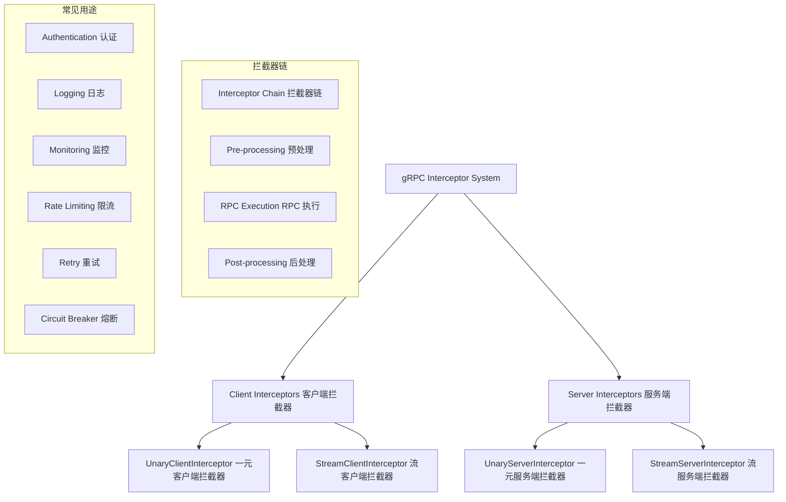
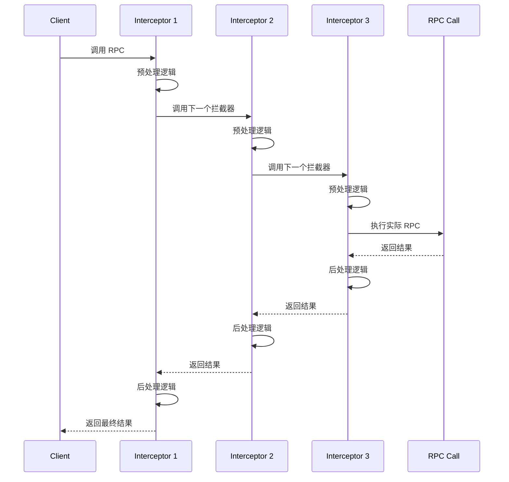
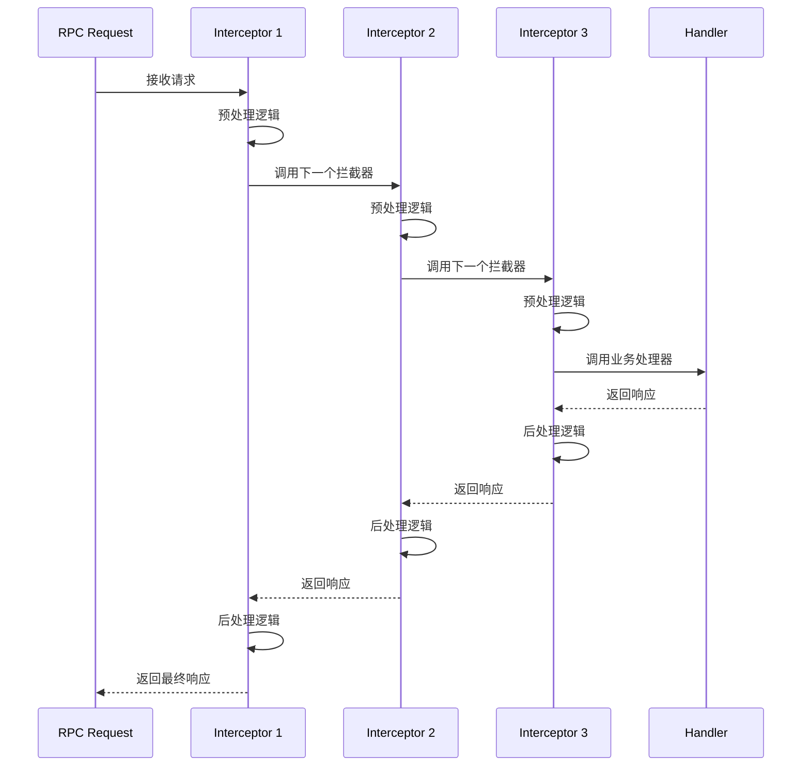

# 拦截器机制 (Interceptor System) 深度分析

## 📖 概述

gRPC-Go 的拦截器系统提供了强大的中间件机制，允许在 RPC 调用的不同阶段插入自定义逻辑。拦截器是实现横切关注点（如认证、日志、监控、重试等）的核心机制，支持客户端和服务端的一元和流式 RPC 拦截。

## 🏗️ 核心架构

### 拦截器系统架构



### 关键接口定义

<augment_code_snippet path="interceptor.go" mode="EXCERPT">
````go
// UnaryClientInterceptor intercepts the execution of a unary RPC on the client.
type UnaryClientInterceptor func(ctx context.Context, method string, req, reply any, 
    cc *ClientConn, invoker UnaryInvoker, opts ...CallOption) error

// StreamClientInterceptor intercepts the creation of a ClientStream.
type StreamClientInterceptor func(ctx context.Context, desc *StreamDesc, cc *ClientConn, 
    method string, streamer Streamer, opts ...CallOption) (ClientStream, error)

// UnaryServerInterceptor provides a hook to intercept the execution of a unary RPC on the server.
type UnaryServerInterceptor func(ctx context.Context, req any, info *UnaryServerInfo, 
    handler UnaryHandler) (resp any, err error)

// StreamServerInterceptor provides a hook to intercept the execution of a streaming RPC on the server.
type StreamServerInterceptor func(srv any, ss ServerStream, info *StreamServerInfo, 
    handler StreamHandler) error
````
</augment_code_snippet>

## 🔄 拦截器执行流程

### 客户端拦截器流程



### 服务端拦截器流程



## 🎯 拦截器实现示例

### 1. 一元客户端拦截器

```go
// 日志拦截器
func loggingUnaryClientInterceptor() grpc.UnaryClientInterceptor {
    return func(ctx context.Context, method string, req, reply any, cc *grpc.ClientConn, 
        invoker grpc.UnaryInvoker, opts ...grpc.CallOption) error {
        
        start := time.Now()
        
        // 记录请求日志
        log.Printf("Calling method: %s", method)
        log.Printf("Request: %+v", req)
        
        // 调用实际的 RPC
        err := invoker(ctx, method, req, reply, cc, opts...)
        
        // 记录响应日志
        duration := time.Since(start)
        if err != nil {
            log.Printf("Method %s failed: %v (duration: %v)", method, err, duration)
        } else {
            log.Printf("Method %s succeeded (duration: %v)", method, duration)
            log.Printf("Response: %+v", reply)
        }
        
        return err
    }
}

// 重试拦截器
func retryUnaryClientInterceptor(maxRetries int, backoff time.Duration) grpc.UnaryClientInterceptor {
    return func(ctx context.Context, method string, req, reply any, cc *grpc.ClientConn, 
        invoker grpc.UnaryInvoker, opts ...grpc.CallOption) error {
        
        var lastErr error
        
        for attempt := 0; attempt <= maxRetries; attempt++ {
            if attempt > 0 {
                // 等待退避时间
                select {
                case <-time.After(backoff * time.Duration(1<<(attempt-1))):
                case <-ctx.Done():
                    return ctx.Err()
                }
            }
            
            // 执行 RPC 调用
            err := invoker(ctx, method, req, reply, cc, opts...)
            if err == nil {
                return nil // 成功，无需重试
            }
            
            lastErr = err
            
            // 检查是否应该重试
            if !shouldRetry(err) {
                break
            }
            
            log.Printf("Attempt %d failed for method %s: %v", attempt+1, method, err)
        }
        
        return lastErr
    }
}

// 判断是否应该重试
func shouldRetry(err error) bool {
    st, ok := status.FromError(err)
    if !ok {
        return false
    }
    
    switch st.Code() {
    case codes.Unavailable, codes.DeadlineExceeded, codes.ResourceExhausted:
        return true
    default:
        return false
    }
}
```

### 2. 一元服务端拦截器

```go
// 认证拦截器
func authUnaryServerInterceptor() grpc.UnaryServerInterceptor {
    return func(ctx context.Context, req any, info *grpc.UnaryServerInfo, 
        handler grpc.UnaryHandler) (any, error) {
        
        // 从元数据中提取认证信息
        md, ok := metadata.FromIncomingContext(ctx)
        if !ok {
            return nil, status.Error(codes.Unauthenticated, "missing metadata")
        }
        
        authHeaders := md.Get("authorization")
        if len(authHeaders) == 0 {
            return nil, status.Error(codes.Unauthenticated, "missing authorization header")
        }
        
        // 验证令牌
        token := strings.TrimPrefix(authHeaders[0], "Bearer ")
        userInfo, err := validateToken(token)
        if err != nil {
            return nil, status.Error(codes.Unauthenticated, "invalid token")
        }
        
        // 将用户信息添加到上下文
        ctx = context.WithValue(ctx, "user", userInfo)
        
        // 调用实际的处理器
        return handler(ctx, req)
    }
}

// 限流拦截器
func rateLimitUnaryServerInterceptor(limiter *rate.Limiter) grpc.UnaryServerInterceptor {
    return func(ctx context.Context, req any, info *grpc.UnaryServerInfo, 
        handler grpc.UnaryHandler) (any, error) {
        
        // 检查限流
        if !limiter.Allow() {
            return nil, status.Error(codes.ResourceExhausted, "rate limit exceeded")
        }
        
        return handler(ctx, req)
    }
}

// 监控拦截器
func monitoringUnaryServerInterceptor() grpc.UnaryServerInterceptor {
    return func(ctx context.Context, req any, info *grpc.UnaryServerInfo, 
        handler grpc.UnaryHandler) (any, error) {
        
        start := time.Now()
        
        // 执行处理器
        resp, err := handler(ctx, req)
        
        // 记录指标
        duration := time.Since(start)
        recordMetrics(info.FullMethod, duration, err)
        
        return resp, err
    }
}

func recordMetrics(method string, duration time.Duration, err error) {
    // 记录请求计数
    requestCounter.WithLabelValues(method).Inc()
    
    // 记录请求延迟
    requestDuration.WithLabelValues(method).Observe(duration.Seconds())
    
    // 记录错误计数
    if err != nil {
        errorCounter.WithLabelValues(method, status.Code(err).String()).Inc()
    }
}
```

### 3. 流式拦截器

```go
// 流式客户端拦截器
func loggingStreamClientInterceptor() grpc.StreamClientInterceptor {
    return func(ctx context.Context, desc *grpc.StreamDesc, cc *grpc.ClientConn, 
        method string, streamer grpc.Streamer, opts ...grpc.CallOption) (grpc.ClientStream, error) {
        
        log.Printf("Starting stream for method: %s", method)
        
        // 创建流
        stream, err := streamer(ctx, desc, cc, method, opts...)
        if err != nil {
            log.Printf("Failed to create stream for method %s: %v", method, err)
            return nil, err
        }
        
        // 包装流以添加日志功能
        return &loggingClientStream{
            ClientStream: stream,
            method:       method,
        }, nil
    }
}

// 日志客户端流包装器
type loggingClientStream struct {
    grpc.ClientStream
    method string
}

func (s *loggingClientStream) SendMsg(m any) error {
    log.Printf("Sending message on stream %s: %+v", s.method, m)
    return s.ClientStream.SendMsg(m)
}

func (s *loggingClientStream) RecvMsg(m any) error {
    err := s.ClientStream.RecvMsg(m)
    if err != nil {
        if err == io.EOF {
            log.Printf("Stream %s ended", s.method)
        } else {
            log.Printf("Error receiving message on stream %s: %v", s.method, err)
        }
    } else {
        log.Printf("Received message on stream %s: %+v", s.method, m)
    }
    return err
}

// 流式服务端拦截器
func authStreamServerInterceptor() grpc.StreamServerInterceptor {
    return func(srv any, ss grpc.ServerStream, info *grpc.StreamServerInfo, 
        handler grpc.StreamHandler) error {
        
        // 认证检查
        ctx := ss.Context()
        if err := authenticateStream(ctx); err != nil {
            return err
        }
        
        // 包装流以添加认证上下文
        wrappedStream := &authenticatedServerStream{
            ServerStream: ss,
            ctx:         ctx,
        }
        
        return handler(srv, wrappedStream)
    }
}

// 认证服务端流包装器
type authenticatedServerStream struct {
    grpc.ServerStream
    ctx context.Context
}

func (s *authenticatedServerStream) Context() context.Context {
    return s.ctx
}
```

## 🔧 拦截器链管理

### 拦截器链构建

```go
// 拦截器链构建器
type InterceptorChain struct {
    unaryClientInterceptors  []grpc.UnaryClientInterceptor
    streamClientInterceptors []grpc.StreamClientInterceptor
    unaryServerInterceptors  []grpc.UnaryServerInterceptor
    streamServerInterceptors []grpc.StreamServerInterceptor
}

func NewInterceptorChain() *InterceptorChain {
    return &InterceptorChain{}
}

func (c *InterceptorChain) AddUnaryClient(interceptor grpc.UnaryClientInterceptor) *InterceptorChain {
    c.unaryClientInterceptors = append(c.unaryClientInterceptors, interceptor)
    return c
}

func (c *InterceptorChain) AddUnaryServer(interceptor grpc.UnaryServerInterceptor) *InterceptorChain {
    c.unaryServerInterceptors = append(c.unaryServerInterceptors, interceptor)
    return c
}

// 构建客户端连接
func (c *InterceptorChain) BuildClient(target string, opts ...grpc.DialOption) (*grpc.ClientConn, error) {
    // 添加拦截器选项
    if len(c.unaryClientInterceptors) > 0 {
        opts = append(opts, grpc.WithChainUnaryInterceptor(c.unaryClientInterceptors...))
    }
    if len(c.streamClientInterceptors) > 0 {
        opts = append(opts, grpc.WithChainStreamInterceptor(c.streamClientInterceptors...))
    }
    
    return grpc.NewClient(target, opts...)
}

// 构建服务端
func (c *InterceptorChain) BuildServer(opts ...grpc.ServerOption) *grpc.Server {
    // 添加拦截器选项
    if len(c.unaryServerInterceptors) > 0 {
        opts = append(opts, grpc.ChainUnaryInterceptor(c.unaryServerInterceptors...))
    }
    if len(c.streamServerInterceptors) > 0 {
        opts = append(opts, grpc.ChainStreamInterceptor(c.streamServerInterceptors...))
    }
    
    return grpc.NewServer(opts...)
}
```

### 条件拦截器

```go
// 条件拦截器包装器
func conditionalInterceptor(condition func(string) bool, interceptor grpc.UnaryServerInterceptor) grpc.UnaryServerInterceptor {
    return func(ctx context.Context, req any, info *grpc.UnaryServerInfo, 
        handler grpc.UnaryHandler) (any, error) {
        
        if condition(info.FullMethod) {
            return interceptor(ctx, req, info, handler)
        }
        
        return handler(ctx, req)
    }
}

// 使用示例
func createConditionalServer() *grpc.Server {
    // 只对特定方法应用认证
    authCondition := func(method string) bool {
        return strings.HasPrefix(method, "/secure.")
    }
    
    // 只对写操作应用限流
    rateLimitCondition := func(method string) bool {
        return strings.Contains(method, "Create") || 
               strings.Contains(method, "Update") || 
               strings.Contains(method, "Delete")
    }
    
    return grpc.NewServer(
        grpc.ChainUnaryInterceptor(
            conditionalInterceptor(authCondition, authUnaryServerInterceptor()),
            conditionalInterceptor(rateLimitCondition, rateLimitUnaryServerInterceptor(limiter)),
            monitoringUnaryServerInterceptor(), // 对所有方法应用监控
        ),
    )
}
```

## 💡 最佳实践

### 1. 拦截器顺序

```go
// 推荐的拦截器顺序
func createOptimalServer() *grpc.Server {
    return grpc.NewServer(
        grpc.ChainUnaryInterceptor(
            // 1. 监控和日志（最外层，记录所有请求）
            monitoringUnaryServerInterceptor(),
            loggingUnaryServerInterceptor(),
            
            // 2. 认证和授权（尽早验证）
            authUnaryServerInterceptor(),
            authzUnaryServerInterceptor(),
            
            // 3. 限流和熔断（保护系统）
            rateLimitUnaryServerInterceptor(limiter),
            circuitBreakerUnaryServerInterceptor(),
            
            // 4. 业务逻辑相关（最内层）
            validationUnaryServerInterceptor(),
            tracingUnaryServerInterceptor(),
        ),
    )
}
```

### 2. 错误处理

```go
// 统一错误处理拦截器
func errorHandlingUnaryServerInterceptor() grpc.UnaryServerInterceptor {
    return func(ctx context.Context, req any, info *grpc.UnaryServerInfo, 
        handler grpc.UnaryHandler) (any, error) {
        
        resp, err := handler(ctx, req)
        
        if err != nil {
            // 记录错误
            log.Printf("Method %s failed: %v", info.FullMethod, err)
            
            // 转换内部错误为 gRPC 状态码
            if st, ok := status.FromError(err); ok {
                return nil, st.Err()
            }
            
            // 处理未知错误
            return nil, status.Error(codes.Internal, "internal server error")
        }
        
        return resp, nil
    }
}
```

### 3. 性能优化

```go
// 高性能拦截器实现
func highPerformanceInterceptor() grpc.UnaryServerInterceptor {
    // 使用对象池减少内存分配
    pool := sync.Pool{
        New: func() any {
            return &RequestContext{}
        },
    }
    
    return func(ctx context.Context, req any, info *grpc.UnaryServerInfo, 
        handler grpc.UnaryHandler) (any, error) {
        
        // 从池中获取对象
        reqCtx := pool.Get().(*RequestContext)
        defer pool.Put(reqCtx)
        
        // 重置对象状态
        reqCtx.Reset()
        reqCtx.Method = info.FullMethod
        reqCtx.StartTime = time.Now()
        
        // 执行处理器
        resp, err := handler(ctx, req)
        
        // 记录指标（异步）
        go recordMetricsAsync(reqCtx, err)
        
        return resp, err
    }
}
```

---

gRPC-Go 的拦截器系统提供了强大而灵活的中间件机制，理解其设计和最佳实践对于构建健壮的 gRPC 应用至关重要。
