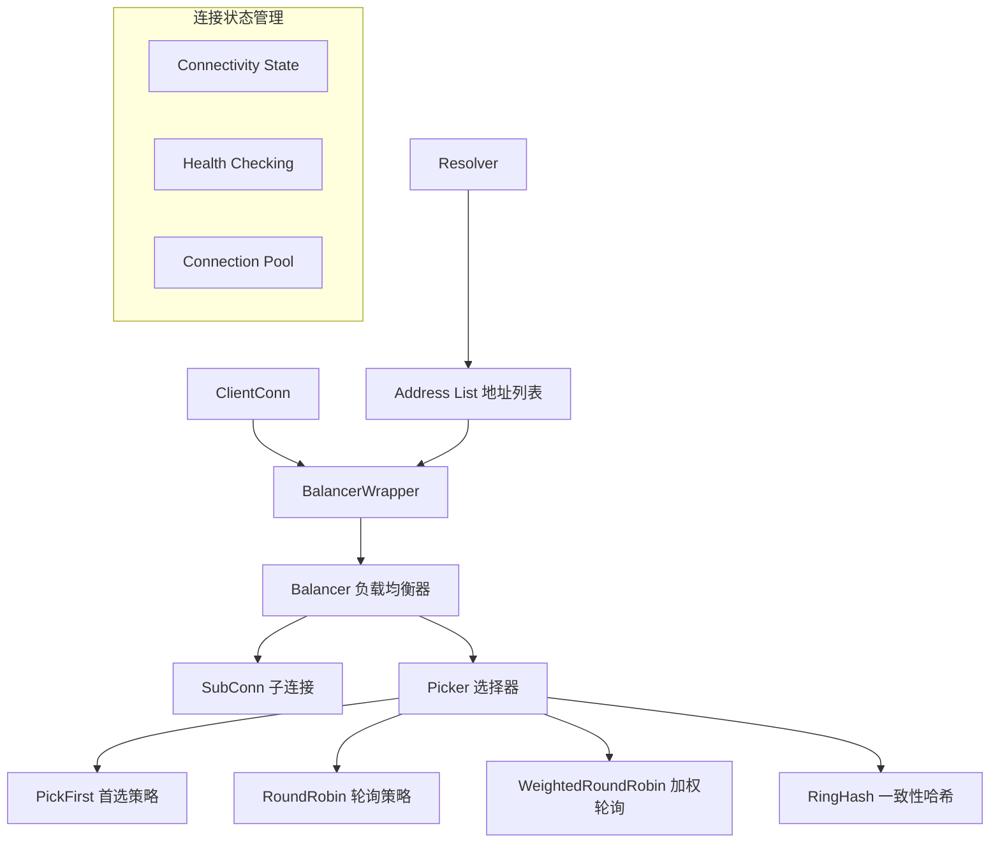
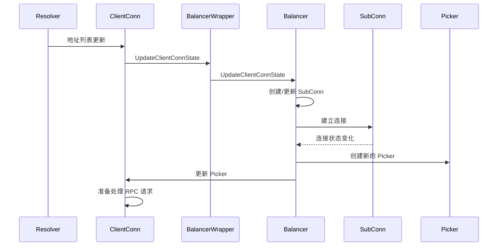
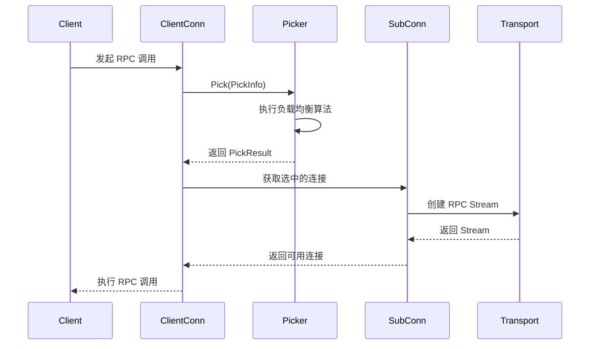
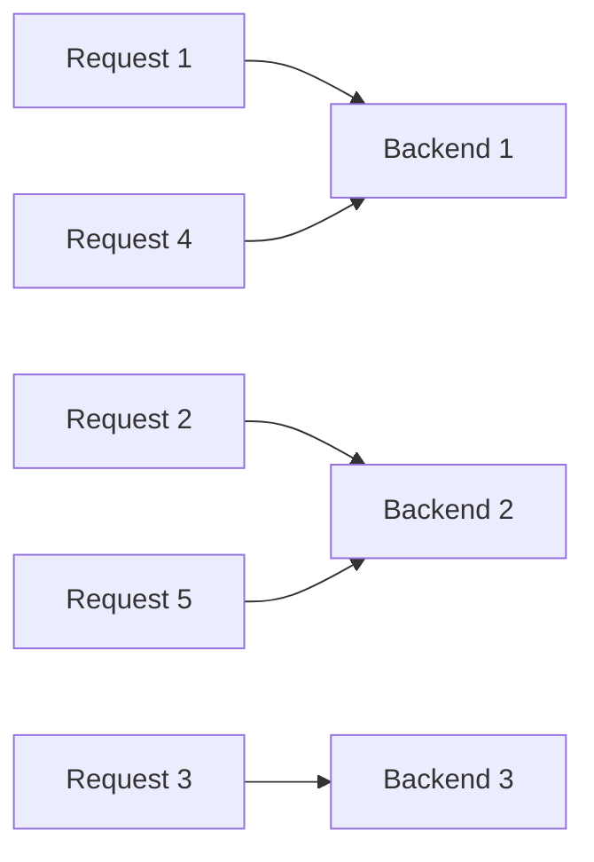
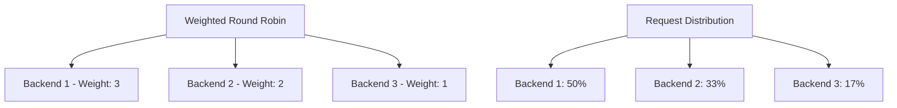
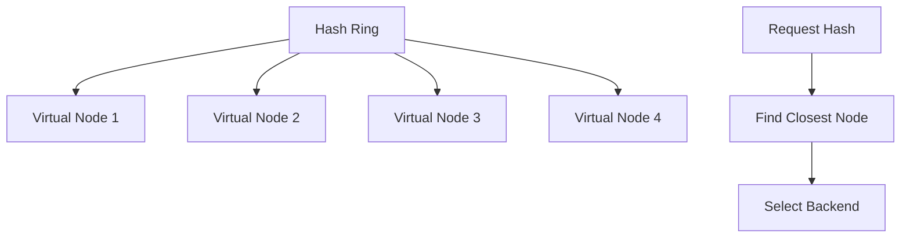
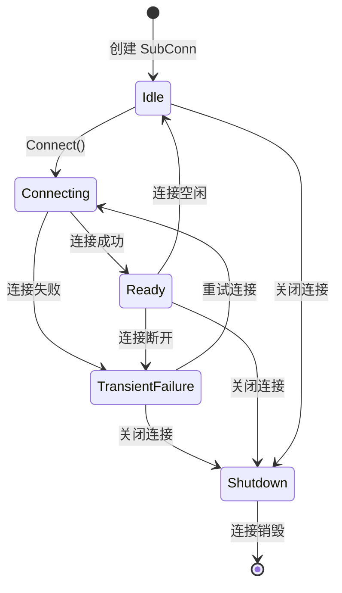

# 负载均衡机制 (Load Balancing) 深度分析

## 📖 概述

gRPC-Go 的负载均衡系统是一个可插拔的架构，支持多种负载均衡策略。它通过 Balancer 接口抽象负载均衡逻辑，通过 Picker 接口实现具体的连接选择策略，为客户端提供高可用和高性能的服务访问能力。

## 🏗️ 核心架构

### 负载均衡组件架构



### 关键接口定义

<augment_code_snippet path="balancer/balancer.go" mode="EXCERPT">
````go
// Balancer takes input from gRPC, manages SubConns, and collects and aggregates
// the connectivity states.
type Balancer interface {
    // UpdateClientConnState is called by gRPC when the state of the ClientConn changes
    UpdateClientConnState(ClientConnState) error
    // ResolverError is called by gRPC when the name resolver reports an error
    ResolverError(error)
    // UpdateSubConnState is called by gRPC when the state of a SubConn changes
    UpdateSubConnState(SubConn, SubConnState)
    // Close closes the balancer
    Close()
}

// Picker is used by gRPC to pick a SubConn to send an RPC.
type Picker interface {
    // Pick returns the connection to use for this RPC and related information.
    Pick(info PickInfo) (PickResult, error)
}
````
</augment_code_snippet>

## 🔄 负载均衡工作流程

### 初始化和状态更新流程



### RPC 调用时的连接选择



## 🎯 内置负载均衡策略

### 1. Pick First 策略

**特点：**
- 总是选择第一个可用的连接
- 简单高效，适合单后端场景
- 提供连接粘性

<augment_code_snippet path="balancer/pickfirst/pickfirst.go" mode="EXCERPT">
````go
// pickfirstBalancer implements the pick first load balancing policy.
type pickfirstBalancer struct {
    state connectivity.State
    cc    balancer.ClientConn
    subConn balancer.SubConn
}

func (b *pickfirstBalancer) Pick(info balancer.PickInfo) (balancer.PickResult, error) {
    if b.subConn == nil {
        return balancer.PickResult{}, balancer.ErrNoSubConnAvailable
    }
    return balancer.PickResult{SubConn: b.subConn}, nil
}
````
</augment_code_snippet>

### 2. Round Robin 策略

**特点：**
- 轮询选择可用连接
- 平均分配请求负载
- 适合同质化后端服务



<augment_code_snippet path="balancer/roundrobin/roundrobin.go" mode="EXCERPT">
````go
// rrPicker implements the round robin picker.
type rrPicker struct {
    subConns []balancer.SubConn
    mu       sync.Mutex
    next     int
}

func (p *rrPicker) Pick(balancer.PickInfo) (balancer.PickResult, error) {
    p.mu.Lock()
    sc := p.subConns[p.next]
    p.next = (p.next + 1) % len(p.subConns)
    p.mu.Unlock()
    return balancer.PickResult{SubConn: sc}, nil
}
````
</augment_code_snippet>

### 3. Weighted Round Robin 策略

**特点：**
- 基于权重的轮询选择
- 支持异构后端服务
- 动态权重调整



### 4. Ring Hash 策略

**特点：**
- 一致性哈希算法
- 支持会话粘性
- 适合有状态服务



## ⚙️ 自定义负载均衡器

### 实现自定义 Balancer

```go
// 自定义负载均衡器示例
type customBalancer struct {
    cc       balancer.ClientConn
    subConns map[resolver.Address]balancer.SubConn
    picker   balancer.Picker
}

func (b *customBalancer) UpdateClientConnState(state balancer.ClientConnState) error {
    // 处理地址列表更新
    addrs := state.ResolverState.Addresses
    
    // 创建或更新 SubConn
    for _, addr := range addrs {
        if _, exists := b.subConns[addr]; !exists {
            subConn, err := b.cc.NewSubConn([]resolver.Address{addr}, balancer.NewSubConnOptions{})
            if err != nil {
                return err
            }
            b.subConns[addr] = subConn
            subConn.Connect()
        }
    }
    
    // 更新 Picker
    b.updatePicker()
    return nil
}

func (b *customBalancer) updatePicker() {
    var readySubConns []balancer.SubConn
    for _, sc := range b.subConns {
        if sc.GetConnectivityState() == connectivity.Ready {
            readySubConns = append(readySubConns, sc)
        }
    }
    
    if len(readySubConns) > 0 {
        b.picker = &customPicker{subConns: readySubConns}
        b.cc.UpdateState(balancer.State{
            ConnectivityState: connectivity.Ready,
            Picker:           b.picker,
        })
    }
}
```

### 实现自定义 Picker

```go
type customPicker struct {
    subConns []balancer.SubConn
    mu       sync.Mutex
    // 自定义状态
}

func (p *customPicker) Pick(info balancer.PickInfo) (balancer.PickResult, error) {
    p.mu.Lock()
    defer p.mu.Unlock()
    
    if len(p.subConns) == 0 {
        return balancer.PickResult{}, balancer.ErrNoSubConnAvailable
    }
    
    // 实现自定义选择逻辑
    selectedSubConn := p.customSelectLogic(info)
    
    return balancer.PickResult{
        SubConn: selectedSubConn,
        Done: func(info balancer.DoneInfo) {
            // 处理请求完成回调
            p.handleRequestDone(info)
        },
    }, nil
}

func (p *customPicker) customSelectLogic(info balancer.PickInfo) balancer.SubConn {
    // 实现自定义选择算法
    // 例如：基于请求特征、负载情况、延迟等
    return p.subConns[0] // 简化示例
}
```

## 🔧 高级特性

### 1. 健康检查集成

```go
// 启用健康检查的负载均衡配置
serviceConfig := `{
    "loadBalancingPolicy": "round_robin",
    "healthCheckConfig": {
        "serviceName": "your.service.name"
    }
}`

conn, err := grpc.NewClient(target,
    grpc.WithDefaultServiceConfig(serviceConfig),
)
```

### 2. 子连接状态管理



### 3. 动态配置更新

```go
// 动态更新负载均衡配置
func updateLoadBalancingConfig(conn *grpc.ClientConn, newConfig string) {
    // 通过服务配置更新负载均衡策略
    resolver := manual.NewBuilderWithScheme("manual")
    resolver.UpdateState(resolver.State{
        Addresses: addresses,
        ServiceConfig: parseServiceConfig(newConfig),
    })
}
```

## 🚀 性能优化

### 1. 连接池优化

```go
// 优化连接池配置
type optimizedBalancer struct {
    maxSubConns int
    minSubConns int
    connPool    sync.Pool
}

func (b *optimizedBalancer) getConnection() balancer.SubConn {
    // 从连接池获取连接
    if conn := b.connPool.Get(); conn != nil {
        return conn.(balancer.SubConn)
    }
    // 创建新连接
    return b.createNewConnection()
}
```

### 2. 请求路由优化

```go
// 基于请求特征的智能路由
func (p *smartPicker) Pick(info balancer.PickInfo) (balancer.PickResult, error) {
    // 分析请求特征
    method := info.FullMethodName
    metadata := info.Ctx.Value("metadata")
    
    // 基于特征选择最优后端
    if isHighPriorityRequest(method, metadata) {
        return p.selectHighPerformanceBackend()
    }
    
    return p.selectNormalBackend()
}
```

## 💡 最佳实践

### 1. 负载均衡策略选择

```go
// 根据场景选择合适的负载均衡策略
var serviceConfigs = map[string]string{
    "single_backend": `{"loadBalancingPolicy": "pick_first"}`,
    "multiple_backends": `{"loadBalancingPolicy": "round_robin"}`,
    "weighted_backends": `{"loadBalancingPolicy": "weighted_round_robin"}`,
    "session_affinity": `{"loadBalancingPolicy": "ring_hash"}`,
}
```

### 2. 健康检查配置

```go
// 推荐的健康检查配置
healthCheckConfig := `{
    "loadBalancingPolicy": "round_robin",
    "healthCheckConfig": {
        "serviceName": "your.service.name",
        "interval": "30s",
        "timeout": "5s",
        "unhealthyThreshold": 3,
        "healthyThreshold": 2
    }
}`
```

### 3. 错误处理和重试

```go
// 负载均衡器错误处理
func (b *resilientBalancer) handleSubConnError(sc balancer.SubConn, err error) {
    // 记录错误
    log.Printf("SubConn error: %v", err)
    
    // 更新连接状态
    b.updateSubConnState(sc, balancer.SubConnState{
        ConnectivityState: connectivity.TransientFailure,
    })
    
    // 触发重连
    go func() {
        time.Sleep(b.backoffDuration)
        sc.Connect()
    }()
}
```

### 4. 监控和指标

```go
// 负载均衡指标收集
type metricsBalancer struct {
    *baseBalancer
    metrics *LoadBalancerMetrics
}

func (b *metricsBalancer) Pick(info balancer.PickInfo) (balancer.PickResult, error) {
    start := time.Now()
    result, err := b.baseBalancer.Pick(info)
    
    // 记录选择延迟
    b.metrics.RecordPickLatency(time.Since(start))
    
    if err != nil {
        b.metrics.IncrementPickErrors()
        return result, err
    }
    
    // 包装 Done 回调以收集更多指标
    originalDone := result.Done
    result.Done = func(info balancer.DoneInfo) {
        b.metrics.RecordRequestDuration(info)
        if originalDone != nil {
            originalDone(info)
        }
    }
    
    return result, nil
}
```

---

gRPC-Go 的负载均衡系统提供了灵活而强大的流量分发能力，理解其架构和实现对于构建高可用的分布式系统至关重要。
