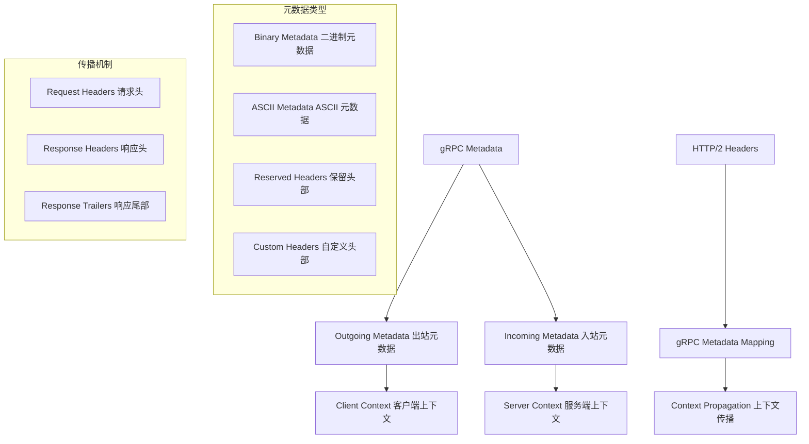
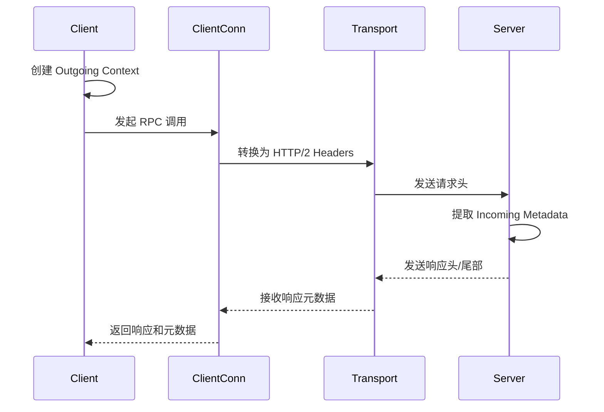
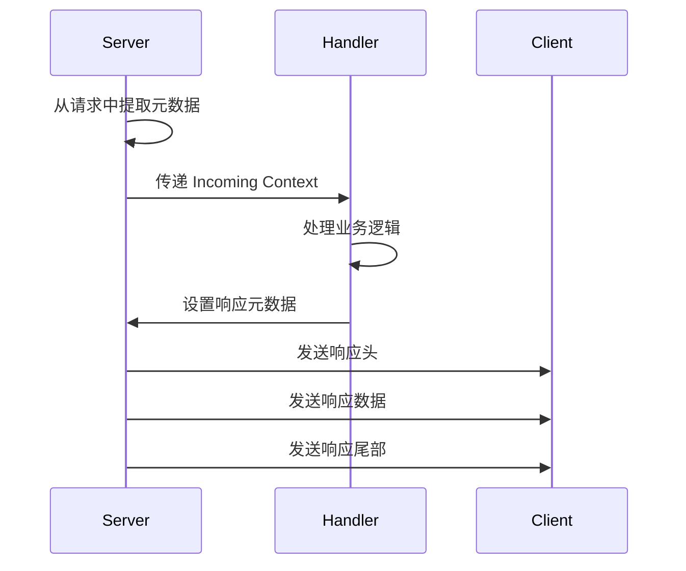

# 元数据处理 (Metadata Handling) 深度分析

## 📖 概述

gRPC-Go 的元数据系统提供了在 RPC 调用中传递额外信息的机制。元数据以键值对的形式存在，类似于 HTTP 头部，可以在客户端和服务端之间双向传递。它是实现认证、追踪、负载均衡提示等横切关注点的重要基础设施。

## 🏗️ 核心架构

### 元数据系统架构



### 关键数据结构

<augment_code_snippet path="metadata/metadata.go" mode="EXCERPT">
````go
// MD is a mapping from metadata keys to values. Users should use the following
// two convenience functions New and Pairs to generate MD.
type MD map[string][]string

// New creates an MD from a given key-value map.
func New(m map[string]string) MD {
    md := make(MD, len(m))
    for k, val := range m {
        key := strings.ToLower(k)
        md[key] = append(md[key], val)
    }
    return md
}

// Pairs returns an MD formed by the mapping of key, value, ...
func Pairs(kv ...string) MD {
    if len(kv)%2 == 1 {
        panic(fmt.Sprintf("metadata: Pairs got the odd number of input pairs for metadata: %d", len(kv)))
    }
    md := make(MD, len(kv)/2)
    for i := 0; i < len(kv); i += 2 {
        key := strings.ToLower(kv[i])
        md[key] = append(md[key], kv[i+1])
    }
    return md
}
````
</augment_code_snippet>

## 🔄 元数据传播机制

### 客户端元数据发送



### 服务端元数据处理



## 🎯 元数据操作 API

### 1. 客户端元数据操作

```go
// 创建出站元数据
func createOutgoingMetadata() context.Context {
    // 方式1：使用 NewOutgoingContext
    md := metadata.New(map[string]string{
        "authorization": "Bearer token123",
        "user-id":      "user456",
        "trace-id":     "trace789",
    })
    ctx := metadata.NewOutgoingContext(context.Background(), md)
    
    // 方式2：使用 AppendToOutgoingContext
    ctx = metadata.AppendToOutgoingContext(context.Background(),
        "authorization", "Bearer token123",
        "user-id", "user456",
        "trace-id", "trace789",
    )
    
    return ctx
}

// 发送带元数据的 RPC 请求
func callWithMetadata(client pb.YourServiceClient) error {
    ctx := createOutgoingMetadata()
    
    // 一元 RPC
    resp, err := client.UnaryMethod(ctx, &pb.Request{})
    if err != nil {
        return err
    }
    
    // 从响应中获取元数据
    var header, trailer metadata.MD
    resp, err = client.UnaryMethod(ctx, &pb.Request{},
        grpc.Header(&header),   // 响应头
        grpc.Trailer(&trailer), // 响应尾部
    )
    
    return nil
}

// 流式 RPC 元数据处理
func streamWithMetadata(client pb.YourServiceClient) error {
    ctx := createOutgoingMetadata()
    
    stream, err := client.StreamMethod(ctx)
    if err != nil {
        return err
    }
    
    // 获取响应头
    header, err := stream.Header()
    if err != nil {
        return err
    }
    
    // 处理流数据...
    
    // 获取响应尾部
    trailer := stream.Trailer()
    
    return nil
}
```

### 2. 服务端元数据操作

```go
// 服务端处理入站元数据
func (s *server) UnaryMethod(ctx context.Context, req *pb.Request) (*pb.Response, error) {
    // 获取入站元数据
    md, ok := metadata.FromIncomingContext(ctx)
    if !ok {
        return nil, status.Error(codes.Internal, "missing metadata")
    }
    
    // 读取特定的元数据值
    authHeaders := md.Get("authorization")
    if len(authHeaders) == 0 {
        return nil, status.Error(codes.Unauthenticated, "missing authorization")
    }
    
    userIDs := md.Get("user-id")
    traceIDs := md.Get("trace-id")
    
    // 设置响应头
    header := metadata.New(map[string]string{
        "server-version": "1.0.0",
        "response-time":  time.Now().Format(time.RFC3339),
    })
    grpc.SendHeader(ctx, header)
    
    // 处理业务逻辑...
    
    // 设置响应尾部
    trailer := metadata.New(map[string]string{
        "processing-time": "100ms",
        "server-load":     "low",
    })
    grpc.SetTrailer(ctx, trailer)
    
    return &pb.Response{}, nil
}

// 流式 RPC 元数据处理
func (s *server) StreamMethod(stream pb.YourService_StreamMethodServer) error {
    // 获取入站元数据
    md, ok := metadata.FromIncomingContext(stream.Context())
    if !ok {
        return status.Error(codes.Internal, "missing metadata")
    }
    
    // 发送响应头
    header := metadata.New(map[string]string{
        "stream-id": "stream123",
    })
    stream.SendHeader(header)
    
    // 处理流数据...
    
    // 设置响应尾部
    trailer := metadata.New(map[string]string{
        "stream-duration": "5s",
    })
    stream.SetTrailer(trailer)
    
    return nil
}
```

## 🔧 高级元数据特性

### 1. 二进制元数据

```go
// 二进制元数据处理
func handleBinaryMetadata() {
    // 二进制键必须以 "-bin" 结尾
    binaryData := []byte{0x01, 0x02, 0x03, 0x04}
    encodedData := base64.StdEncoding.EncodeToString(binaryData)
    
    md := metadata.New(map[string]string{
        "binary-data-bin": encodedData,
        "text-data":       "normal text",
    })
    
    ctx := metadata.NewOutgoingContext(context.Background(), md)
    
    // 在服务端解码二进制数据
    if md, ok := metadata.FromIncomingContext(ctx); ok {
        if values := md.Get("binary-data-bin"); len(values) > 0 {
            decodedData, err := base64.StdEncoding.DecodeString(values[0])
            if err == nil {
                // 使用解码后的二进制数据
                processBinaryData(decodedData)
            }
        }
    }
}
```

### 2. 元数据拦截器

```go
// 客户端元数据拦截器
func clientMetadataInterceptor() grpc.UnaryClientInterceptor {
    return func(ctx context.Context, method string, req, reply any, cc *grpc.ClientConn, 
        invoker grpc.UnaryInvoker, opts ...grpc.CallOption) error {
        
        // 自动添加通用元数据
        ctx = metadata.AppendToOutgoingContext(ctx,
            "client-version", "1.0.0",
            "request-id", generateRequestID(),
            "timestamp", time.Now().Format(time.RFC3339),
        )
        
        // 调用原始方法
        return invoker(ctx, method, req, reply, cc, opts...)
    }
}

// 服务端元数据拦截器
func serverMetadataInterceptor() grpc.UnaryServerInterceptor {
    return func(ctx context.Context, req any, info *grpc.UnaryServerInfo, 
        handler grpc.UnaryHandler) (any, error) {
        
        // 记录请求元数据
        if md, ok := metadata.FromIncomingContext(ctx); ok {
            logRequestMetadata(info.FullMethod, md)
        }
        
        // 添加响应头
        header := metadata.New(map[string]string{
            "server-instance": getServerInstanceID(),
            "processing-node": getNodeID(),
        })
        grpc.SendHeader(ctx, header)
        
        // 执行处理器
        resp, err := handler(ctx, req)
        
        // 添加响应尾部
        trailer := metadata.New(map[string]string{
            "execution-time": getExecutionTime(ctx),
        })
        grpc.SetTrailer(ctx, trailer)
        
        return resp, err
    }
}
```

### 3. 元数据传播链

```go
// 元数据传播链实现
type MetadataPropagator struct {
    propagateKeys []string
}

func NewMetadataPropagator(keys ...string) *MetadataPropagator {
    return &MetadataPropagator{propagateKeys: keys}
}

func (p *MetadataPropagator) Extract(ctx context.Context) metadata.MD {
    md, ok := metadata.FromIncomingContext(ctx)
    if !ok {
        return metadata.MD{}
    }
    
    extracted := metadata.MD{}
    for _, key := range p.propagateKeys {
        if values := md.Get(key); len(values) > 0 {
            extracted[key] = values
        }
    }
    
    return extracted
}

func (p *MetadataPropagator) Inject(ctx context.Context, md metadata.MD) context.Context {
    if len(md) == 0 {
        return ctx
    }
    
    return metadata.NewOutgoingContext(ctx, md)
}

// 使用传播链的拦截器
func propagationInterceptor(propagator *MetadataPropagator) grpc.UnaryServerInterceptor {
    return func(ctx context.Context, req any, info *grpc.UnaryServerInfo, 
        handler grpc.UnaryHandler) (any, error) {
        
        // 提取需要传播的元数据
        propagatedMD := propagator.Extract(ctx)
        
        // 在下游调用中注入元数据
        if len(propagatedMD) > 0 {
            ctx = propagator.Inject(ctx, propagatedMD)
        }
        
        return handler(ctx, req)
    }
}
```

## 🚀 性能优化

### 1. 元数据缓存

```go
// 元数据缓存实现
type MetadataCache struct {
    cache sync.Map
    ttl   time.Duration
}

type cachedMetadata struct {
    md        metadata.MD
    timestamp time.Time
}

func (c *MetadataCache) Get(key string) (metadata.MD, bool) {
    if value, ok := c.cache.Load(key); ok {
        cached := value.(*cachedMetadata)
        if time.Since(cached.timestamp) < c.ttl {
            return cached.md, true
        }
        c.cache.Delete(key)
    }
    return nil, false
}

func (c *MetadataCache) Set(key string, md metadata.MD) {
    c.cache.Store(key, &cachedMetadata{
        md:        md,
        timestamp: time.Now(),
    })
}

// 使用缓存的元数据拦截器
func cachedMetadataInterceptor(cache *MetadataCache) grpc.UnaryClientInterceptor {
    return func(ctx context.Context, method string, req, reply any, cc *grpc.ClientConn, 
        invoker grpc.UnaryInvoker, opts ...grpc.CallOption) error {
        
        cacheKey := generateCacheKey(method, req)
        
        // 尝试从缓存获取元数据
        if cachedMD, found := cache.Get(cacheKey); found {
            ctx = metadata.NewOutgoingContext(ctx, cachedMD)
        } else {
            // 生成新的元数据并缓存
            md := generateMetadata(method, req)
            cache.Set(cacheKey, md)
            ctx = metadata.NewOutgoingContext(ctx, md)
        }
        
        return invoker(ctx, method, req, reply, cc, opts...)
    }
}
```

### 2. 元数据压缩

```go
// 元数据压缩实现
func compressMetadata(md metadata.MD) metadata.MD {
    compressed := metadata.MD{}
    
    for key, values := range md {
        if shouldCompress(key, values) {
            // 压缩大的元数据值
            compressedValue := compressValues(values)
            compressed[key+"-compressed"] = []string{compressedValue}
        } else {
            compressed[key] = values
        }
    }
    
    return compressed
}

func decompressMetadata(md metadata.MD) metadata.MD {
    decompressed := metadata.MD{}
    
    for key, values := range md {
        if strings.HasSuffix(key, "-compressed") {
            // 解压缩元数据值
            originalKey := strings.TrimSuffix(key, "-compressed")
            decompressedValues := decompressValues(values[0])
            decompressed[originalKey] = decompressedValues
        } else {
            decompressed[key] = values
        }
    }
    
    return decompressed
}
```

## 💡 最佳实践

### 1. 元数据命名规范

```go
// 推荐的元数据键命名规范
const (
    // 认证相关
    AuthorizationKey = "authorization"
    UserIDKey       = "user-id"
    SessionIDKey    = "session-id"
    
    // 追踪相关
    TraceIDKey      = "trace-id"
    SpanIDKey       = "span-id"
    RequestIDKey    = "request-id"
    
    // 路由相关
    VersionKey      = "version"
    RegionKey       = "region"
    ClusterKey      = "cluster"
    
    // 二进制数据（必须以 -bin 结尾）
    BinaryDataKey   = "binary-data-bin"
    EncryptedKey    = "encrypted-data-bin"
)

// 元数据验证
func validateMetadata(md metadata.MD) error {
    for key := range md {
        // 检查键名格式
        if !isValidMetadataKey(key) {
            return fmt.Errorf("invalid metadata key: %s", key)
        }
        
        // 检查二进制键
        if strings.HasSuffix(key, "-bin") && !isValidBinaryKey(key) {
            return fmt.Errorf("invalid binary metadata key: %s", key)
        }
    }
    return nil
}
```

### 2. 错误处理

```go
// 安全的元数据提取
func safeGetMetadata(ctx context.Context, key string) (string, bool) {
    md, ok := metadata.FromIncomingContext(ctx)
    if !ok {
        return "", false
    }
    
    values := md.Get(key)
    if len(values) == 0 {
        return "", false
    }
    
    // 返回第一个值
    return values[0], true
}

// 元数据错误处理
func handleMetadataError(err error) error {
    switch {
    case errors.Is(err, context.DeadlineExceeded):
        return status.Error(codes.DeadlineExceeded, "metadata processing timeout")
    case errors.Is(err, context.Canceled):
        return status.Error(codes.Canceled, "metadata processing canceled")
    default:
        return status.Error(codes.Internal, "metadata processing failed")
    }
}
```

### 3. 监控和调试

```go
// 元数据监控拦截器
func metadataMonitoringInterceptor() grpc.UnaryServerInterceptor {
    return func(ctx context.Context, req any, info *grpc.UnaryServerInfo, 
        handler grpc.UnaryHandler) (any, error) {
        
        start := time.Now()
        
        // 记录入站元数据
        if md, ok := metadata.FromIncomingContext(ctx); ok {
            recordIncomingMetadata(info.FullMethod, md)
        }
        
        resp, err := handler(ctx, req)
        
        // 记录处理时间
        duration := time.Since(start)
        recordMetadataProcessingTime(info.FullMethod, duration)
        
        return resp, err
    }
}

// 元数据调试工具
func debugMetadata(ctx context.Context) {
    if md, ok := metadata.FromIncomingContext(ctx); ok {
        log.Printf("Incoming metadata:")
        for key, values := range md {
            log.Printf("  %s: %v", key, values)
        }
    }
}
```

---

gRPC-Go 的元数据系统提供了灵活而强大的信息传递机制，理解其使用方法和最佳实践对于构建功能丰富的 gRPC 应用至关重要。
