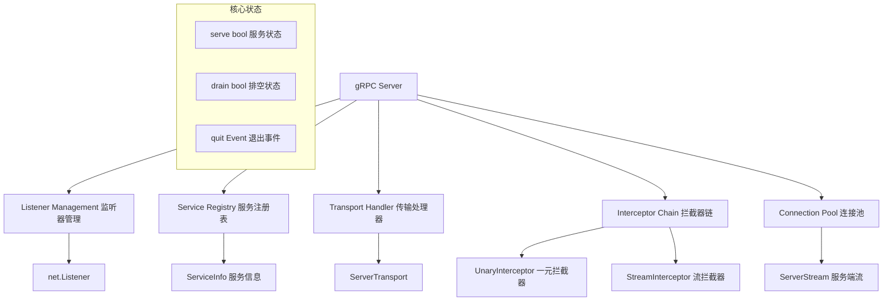
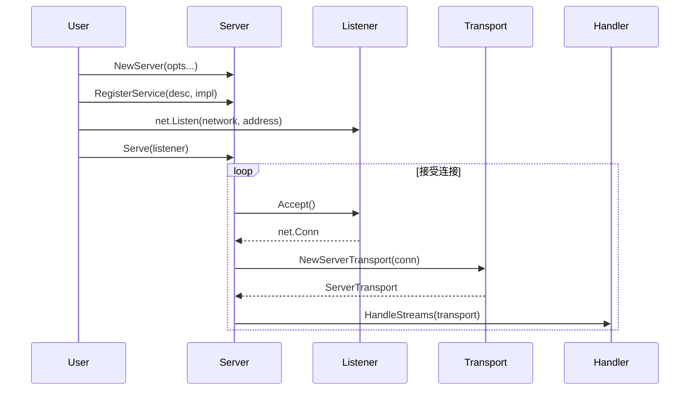
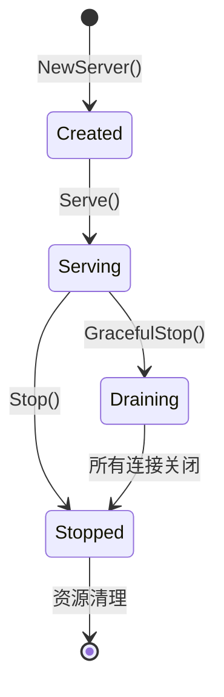
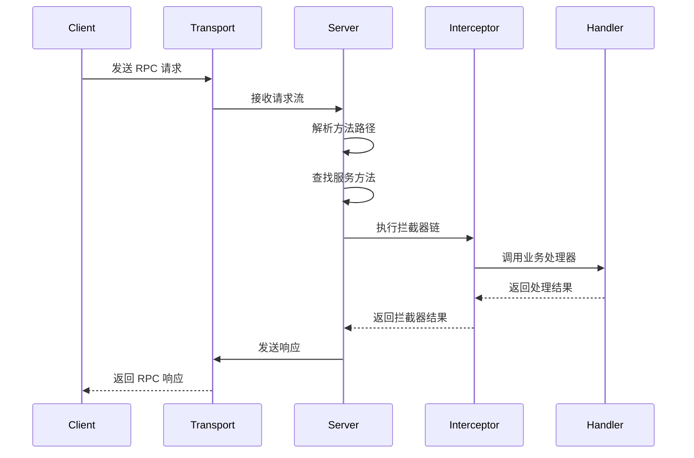
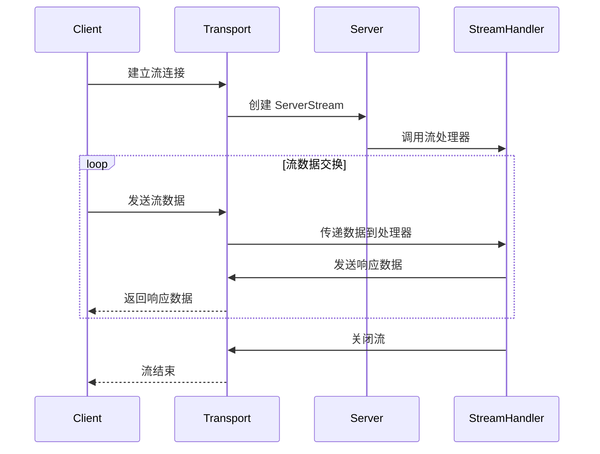
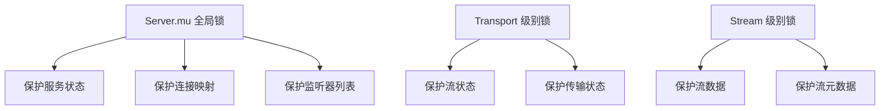

# 服务端实现 (Server) 深度分析

## 📖 概述

gRPC Server 是 gRPC-Go 服务端的核心组件，负责监听网络连接、处理 RPC 请求、管理服务注册、执行拦截器链等关键功能。它提供了完整的服务端 RPC 处理能力。

## 🏗️ 核心架构

### Server 结构设计



### 关键数据结构

<augment_code_snippet path="server.go" mode="EXCERPT">
````go
// Server is a gRPC server to serve RPC requests.
type Server struct {
    opts serverOptions
    
    mu  sync.Mutex // guards following
    lis map[net.Listener]bool
    // conns contains all active server transports
    conns    map[string]map[transport.ServerTransport]bool
    serve    bool
    drain    bool
    cv       *sync.Cond              // signaled when connections close for GracefulStop
    services map[string]*serviceInfo // service name -> service info
    events   traceEventLog
}
````
</augment_code_snippet>

## 🔄 服务端生命周期

### 服务启动流程



### 服务状态机



## 🔧 核心功能实现

### 1. 服务注册机制

<augment_code_snippet path="server.go" mode="EXCERPT">
````go
// serviceInfo contains the information of a service.
type serviceInfo struct {
    // Contains the implementation for the methods in this service.
    serviceImpl any
    methods     map[string]*MethodDesc
    streams     map[string]*StreamDesc
    mdata       any
}

// RegisterService registers a service and its implementation to the gRPC server.
func (s *Server) RegisterService(sd *ServiceDesc, ss any) {
    s.register(sd, ss)
}
````
</augment_code_snippet>

**服务注册流程：**
1. 解析服务描述符 (ServiceDesc)
2. 验证服务实现接口
3. 构建方法路由表
4. 存储到服务注册表

### 2. 连接处理机制


### 3. RPC 请求处理

<augment_code_snippet path="server.go" mode="EXCERPT">
````go
// processUnaryRPC processes a unary RPC.
func (s *Server) processUnaryRPC(ctx context.Context, t transport.ServerTransport, 
    stream *transport.Stream, info *serviceInfo, md *MethodDesc, trInfo *traceInfo) error {
    
    // Apply interceptors
    if s.opts.unaryInt != nil {
        return s.opts.unaryInt(ctx, req, info, handler)
    }
    
    // Call the actual handler
    return handler(ctx, req)
}
````
</augment_code_snippet>

## 🎯 请求处理流程

### 一元 RPC 处理



### 流式 RPC 处理



## ⚙️ 服务配置管理

### ServerOptions 配置系统

```go
// 常用服务端配置
server := grpc.NewServer(
    grpc.Creds(credentials.NewTLS(tlsConfig)),           // TLS 认证
    grpc.UnaryInterceptor(unaryInterceptor),             // 一元拦截器
    grpc.StreamInterceptor(streamInterceptor),           // 流拦截器
    grpc.MaxRecvMsgSize(4*1024*1024),                   // 最大接收消息大小
    grpc.MaxSendMsgSize(4*1024*1024),                   // 最大发送消息大小
    grpc.KeepaliveParams(keepalive.ServerParameters{    // 保活参数
        Time:    60 * time.Second,
        Timeout: 5 * time.Second,
    }),
    grpc.KeepaliveEnforcementPolicy(keepalive.EnforcementPolicy{
        MinTime:             30 * time.Second,
        PermitWithoutStream: true,
    }),
)
```

### 拦截器链配置

```go
// 拦截器链示例
func chainUnaryInterceptors(interceptors ...grpc.UnaryServerInterceptor) grpc.UnaryServerInterceptor {
    return func(ctx context.Context, req any, info *grpc.UnaryServerInfo, 
        handler grpc.UnaryHandler) (any, error) {
        
        // 构建拦截器链
        chain := handler
        for i := len(interceptors) - 1; i >= 0; i-- {
            chain = build(interceptors[i], chain, info)
        }
        return chain(ctx, req)
    }
}
```

## 🔒 并发安全设计

### 连接管理



### 优雅关闭机制

<augment_code_snippet path="server.go" mode="EXCERPT">
````go
// GracefulStop stops the gRPC server gracefully.
func (s *Server) GracefulStop() {
    s.mu.Lock()
    if s.conns == nil {
        s.mu.Unlock()
        return
    }
    
    s.drain = true
    // 通知所有传输层开始排空
    for lis := range s.lis {
        lis.Close()
    }
    for _, conns := range s.conns {
        for st := range conns {
            st.Drain("graceful_stop")
        }
    }
    s.mu.Unlock()
    
    // 等待所有连接关闭
    s.mu.Lock()
    for len(s.conns) != 0 {
        s.cv.Wait()
    }
    s.mu.Unlock()
}
````
</augment_code_snippet>

## 🚀 性能优化特性

### 1. 连接复用
- HTTP/2 多路复用：单连接处理多个并发 RPC
- 连接池管理：高效管理活跃连接

### 2. 内存优化
- 对象池：复用频繁创建的对象
- 流式处理：避免大消息的内存拷贝
- 缓冲区管理：使用 mem.BufferSlice 优化内存使用

### 3. 并发优化
- 无锁设计：关键路径避免锁竞争
- 异步处理：非阻塞的请求处理
- 批量操作：批量处理网络 I/O

## 🔍 监控和调试

### Channelz 集成

```go
// 获取服务器统计信息
func (s *Server) channelzMetric() *channelz.ServerInternalMetric {
    return &channelz.ServerInternalMetric{
        CallsStarted:             atomic.LoadInt64(&s.czData.callsStarted),
        CallsSucceeded:          atomic.LoadInt64(&s.czData.callsSucceeded),
        CallsFailed:             atomic.LoadInt64(&s.czData.callsFailed),
        LastCallStartedTimestamp: time.Unix(0, atomic.LoadInt64(&s.czData.lastCallStartedTime)),
    }
}
```

### 健康检查集成

```go
import "google.golang.org/grpc/health"
import healthpb "google.golang.org/grpc/health/grpc_health_v1"

// 注册健康检查服务
healthServer := health.NewServer()
healthpb.RegisterHealthServer(server, healthServer)

// 设置服务健康状态
healthServer.SetServingStatus("your.service.name", healthpb.HealthCheckResponse_SERVING)
```

## 💡 最佳实践

### 1. 服务启动模式

```go
// 推荐的服务启动模式
func main() {
    // 创建监听器
    lis, err := net.Listen("tcp", ":50051")
    if err != nil {
        log.Fatalf("failed to listen: %v", err)
    }
    
    // 创建服务器
    server := grpc.NewServer(
        grpc.Creds(credentials.NewTLS(tlsConfig)),
        grpc.UnaryInterceptor(loggingInterceptor),
    )
    
    // 注册服务
    pb.RegisterYourServiceServer(server, &yourServiceImpl{})
    
    // 注册健康检查
    healthpb.RegisterHealthServer(server, health.NewServer())
    
    // 启动服务
    log.Println("Server starting on :50051")
    if err := server.Serve(lis); err != nil {
        log.Fatalf("failed to serve: %v", err)
    }
}
```

### 2. 优雅关闭

```go
// 优雅关闭示例
func gracefulShutdown(server *grpc.Server) {
    c := make(chan os.Signal, 1)
    signal.Notify(c, os.Interrupt, syscall.SIGTERM)
    
    go func() {
        <-c
        log.Println("Shutting down server...")
        server.GracefulStop()
    }()
}
```

### 3. 错误处理

```go
// 统一错误处理拦截器
func errorHandlingInterceptor(ctx context.Context, req any, info *grpc.UnaryServerInfo, 
    handler grpc.UnaryHandler) (any, error) {
    
    resp, err := handler(ctx, req)
    if err != nil {
        // 记录错误日志
        log.Printf("RPC error in %s: %v", info.FullMethod, err)
        
        // 转换为 gRPC 状态码
        if st, ok := status.FromError(err); ok {
            return nil, st.Err()
        }
        return nil, status.Error(codes.Internal, "internal server error")
    }
    return resp, nil
}
```

### 4. 性能监控

```go
// 性能监控拦截器
func metricsInterceptor(ctx context.Context, req any, info *grpc.UnaryServerInfo, 
    handler grpc.UnaryHandler) (any, error) {
    
    start := time.Now()
    resp, err := handler(ctx, req)
    duration := time.Since(start)
    
    // 记录指标
    recordMetrics(info.FullMethod, duration, err)
    
    return resp, err
}
```

---

gRPC Server 提供了强大而灵活的服务端 RPC 处理能力，理解其架构和最佳实践对于构建高性能的 gRPC 服务至关重要。
