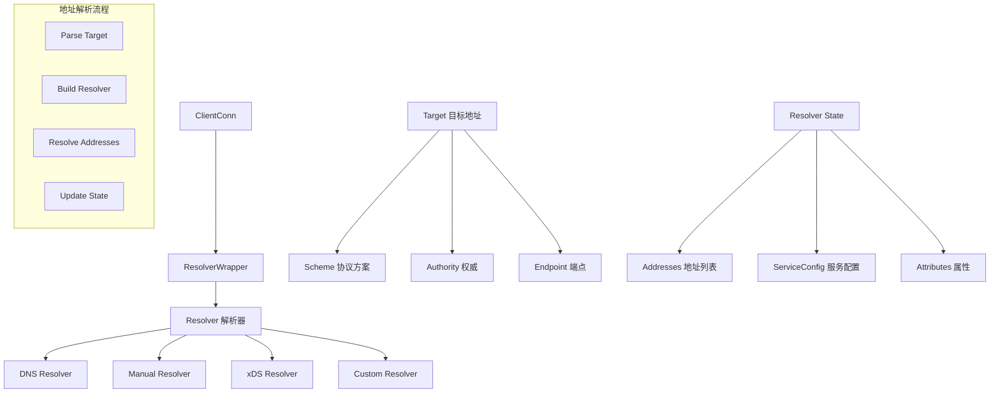
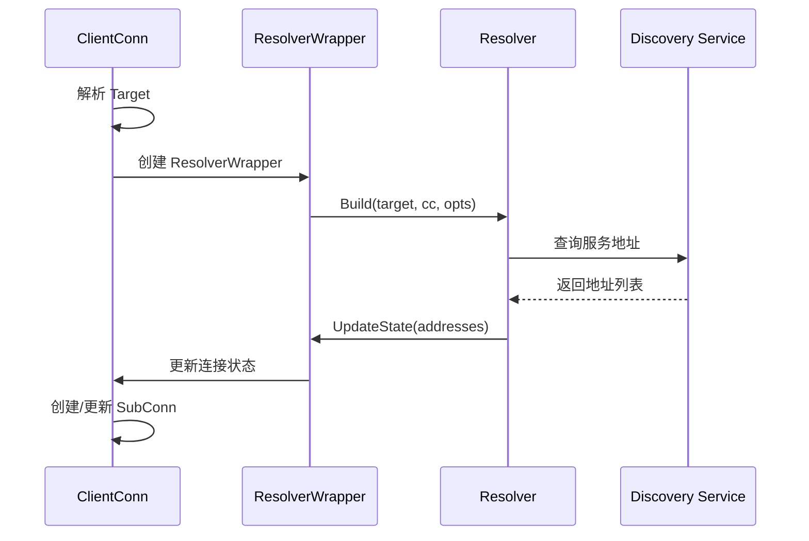
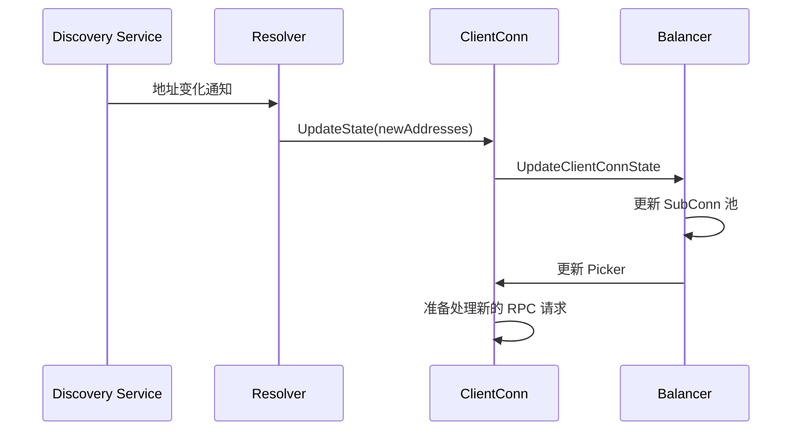

# 服务发现系统 (Service Discovery) 深度分析

## 📖 概述

gRPC-Go 的服务发现系统通过 Resolver 接口提供了可插拔的服务发现机制。它负责将服务名称解析为具体的网络地址，支持多种发现方式，包括 DNS、手动配置、xDS 等，为客户端提供动态的服务端点发现能力。

## 🏗️ 核心架构

### 服务发现组件架构



### 关键接口定义

<augment_code_snippet path="resolver/resolver.go" mode="EXCERPT">
````go
// Builder creates a resolver that will be used to watch name resolution updates.
type Builder interface {
    // Build creates a new resolver for the given target.
    Build(target Target, cc ClientConn, opts BuildOptions) (Resolver, error)
    // Scheme returns the scheme supported by this resolver.
    Scheme() string
}

// Resolver watches for the updates on the specified target.
type Resolver interface {
    // ResolveNow will be called by gRPC to try to resolve the target name again.
    ResolveNow(ResolveNowOptions)
    // Close closes the resolver.
    Close()
}

// ClientConn contains the callbacks for resolver to notify any updates.
type ClientConn interface {
    // UpdateState updates the state of the ClientConn appropriately.
    UpdateState(State) error
    // ReportError notifies the ClientConn that the Resolver encountered an error.
    ReportError(error)
}
````
</augment_code_snippet>

## 🔄 服务发现工作流程

### 解析器初始化流程



### 动态更新流程



## 🎯 内置解析器实现

### 1. DNS Resolver

**特点：**
- 支持标准 DNS 解析
- 支持 SRV 记录查询
- 自动重解析机制
- 支持负载均衡配置

<augment_code_snippet path="resolver/dns/dns_resolver.go" mode="EXCERPT">
````go
// dnsResolver implements the Resolver interface.
type dnsResolver struct {
    host                 string
    port                 string
    ctx                  context.Context
    cancel               context.CancelFunc
    cc                   resolver.ClientConn
    rn                   chan struct{}
    disableServiceConfig bool
}

func (d *dnsResolver) ResolveNow(resolver.ResolveNowOptions) {
    select {
    case d.rn <- struct{}{}:
    default:
    }
}
````
</augment_code_snippet>

**DNS 解析示例：**
```go
// DNS 目标格式
targets := []string{
    "dns:///service.example.com:8080",
    "dns://8.8.8.8/service.example.com:8080",
    "service.example.com:8080", // 默认使用 DNS
}
```

### 2. Manual Resolver

**特点：**
- 手动配置服务地址
- 支持动态地址更新
- 适合测试和开发环境
- 完全可控的地址管理

<augment_code_snippet path="resolver/manual/manual.go" mode="EXCERPT">
````go
// Resolver is also a resolver builder.
type Resolver struct {
    BuildCallback       func(resolver.Target, resolver.ClientConn, resolver.BuildOptions)
    UpdateStateCallback func(err error)
    ResolveNowCallback  func(resolver.ResolveNowOptions)
    CloseCallback       func()
    
    mu            sync.Mutex
    cc            resolver.ClientConn
    lastSeenState *resolver.State
}

func (r *Resolver) UpdateState(s resolver.State) {
    r.mu.Lock()
    defer r.mu.Unlock()
    r.lastSeenState = &s
    if r.cc != nil {
        err := r.cc.UpdateState(s)
        r.UpdateStateCallback(err)
    }
}
````
</augment_code_snippet>

**Manual Resolver 使用示例：**
```go
// 创建手动解析器
resolver := manual.NewBuilderWithScheme("manual")

// 设置初始地址
resolver.InitialState(resolver.State{
    Addresses: []resolver.Address{
        {Addr: "localhost:8080"},
        {Addr: "localhost:8081"},
    },
})

// 创建连接
conn, err := grpc.NewClient("manual:///service", 
    grpc.WithResolvers(resolver))

// 动态更新地址
resolver.UpdateState(resolver.State{
    Addresses: []resolver.Address{
        {Addr: "localhost:8080"},
        {Addr: "localhost:8082"}, // 新地址
    },
})
```

### 3. Passthrough Resolver

**特点：**
- 直接传递目标地址
- 不进行任何解析
- 适合直连场景

```go
// Passthrough 目标格式
conn, err := grpc.NewClient("passthrough:///localhost:8080")
```

## ⚙️ 自定义解析器实现

### 实现自定义 Resolver Builder

```go
// 自定义解析器构建器
type customResolverBuilder struct {
    scheme string
}

func (b *customResolverBuilder) Build(target resolver.Target, cc resolver.ClientConn, 
    opts resolver.BuildOptions) (resolver.Resolver, error) {
    
    r := &customResolver{
        target: target,
        cc:     cc,
        done:   make(chan struct{}),
    }
    
    // 启动解析协程
    go r.start()
    return r, nil
}

func (b *customResolverBuilder) Scheme() string {
    return b.scheme
}

// 注册自定义解析器
func init() {
    resolver.Register(&customResolverBuilder{scheme: "custom"})
}
```

### 实现自定义 Resolver

```go
type customResolver struct {
    target resolver.Target
    cc     resolver.ClientConn
    done   chan struct{}
}

func (r *customResolver) start() {
    // 初始解析
    r.resolve()
    
    // 定期重解析
    ticker := time.NewTicker(30 * time.Second)
    defer ticker.Stop()
    
    for {
        select {
        case <-ticker.C:
            r.resolve()
        case <-r.done:
            return
        }
    }
}

func (r *customResolver) resolve() {
    // 实现自定义解析逻辑
    addresses := r.discoverServices(r.target.Endpoint())
    
    state := resolver.State{
        Addresses: addresses,
    }
    
    if err := r.cc.UpdateState(state); err != nil {
        r.cc.ReportError(err)
    }
}

func (r *customResolver) discoverServices(endpoint string) []resolver.Address {
    // 实现服务发现逻辑
    // 例如：查询注册中心、配置中心等
    return []resolver.Address{
        {Addr: "service1:8080"},
        {Addr: "service2:8080"},
    }
}

func (r *customResolver) ResolveNow(resolver.ResolveNowOptions) {
    go r.resolve()
}

func (r *customResolver) Close() {
    close(r.done)
}
```

## 🔧 高级特性

### 1. 服务配置集成

```go
// 解析器可以返回服务配置
func (r *customResolver) resolve() {
    addresses := r.discoverServices()
    serviceConfig := r.getServiceConfig()
    
    state := resolver.State{
        Addresses:     addresses,
        ServiceConfig: r.cc.ParseServiceConfig(serviceConfig),
    }
    
    r.cc.UpdateState(state)
}

func (r *customResolver) getServiceConfig() string {
    return `{
        "loadBalancingPolicy": "round_robin",
        "retryPolicy": {
            "maxAttempts": 3,
            "initialBackoff": "0.1s",
            "maxBackoff": "1s"
        }
    }`
}
```

### 2. 地址属性管理

```go
// 为地址添加自定义属性
func (r *customResolver) resolve() {
    addresses := []resolver.Address{
        {
            Addr: "service1:8080",
            Attributes: attributes.New("weight", 100).
                WithValue("zone", "us-east-1"),
        },
        {
            Addr: "service2:8080", 
            Attributes: attributes.New("weight", 200).
                WithValue("zone", "us-west-1"),
        },
    }
    
    r.cc.UpdateState(resolver.State{Addresses: addresses})
}
```

### 3. 健康检查集成

```go
// 集成健康检查的解析器
type healthAwareResolver struct {
    *customResolver
    healthChecker HealthChecker
}

func (r *healthAwareResolver) resolve() {
    allAddresses := r.discoverServices()
    healthyAddresses := []resolver.Address{}
    
    for _, addr := range allAddresses {
        if r.healthChecker.IsHealthy(addr.Addr) {
            healthyAddresses = append(healthyAddresses, addr)
        }
    }
    
    r.cc.UpdateState(resolver.State{Addresses: healthyAddresses})
}
```

## 🚀 性能优化

### 1. 缓存机制

```go
type cachedResolver struct {
    *customResolver
    cache     map[string][]resolver.Address
    cacheTTL  time.Duration
    lastFetch time.Time
    mu        sync.RWMutex
}

func (r *cachedResolver) resolve() {
    r.mu.RLock()
    if time.Since(r.lastFetch) < r.cacheTTL {
        if cached, exists := r.cache[r.target.Endpoint()]; exists {
            r.mu.RUnlock()
            r.cc.UpdateState(resolver.State{Addresses: cached})
            return
        }
    }
    r.mu.RUnlock()
    
    // 执行实际解析
    addresses := r.discoverServices()
    
    r.mu.Lock()
    r.cache[r.target.Endpoint()] = addresses
    r.lastFetch = time.Now()
    r.mu.Unlock()
    
    r.cc.UpdateState(resolver.State{Addresses: addresses})
}
```

### 2. 批量解析

```go
// 批量解析多个服务
type batchResolver struct {
    targets   []resolver.Target
    batchSize int
}

func (r *batchResolver) resolveBatch() {
    var wg sync.WaitGroup
    semaphore := make(chan struct{}, r.batchSize)
    
    for _, target := range r.targets {
        wg.Add(1)
        go func(t resolver.Target) {
            defer wg.Done()
            semaphore <- struct{}{}
            defer func() { <-semaphore }()
            
            r.resolveSingle(t)
        }(target)
    }
    
    wg.Wait()
}
```

## 💡 最佳实践

### 1. 解析器选择策略

```go
// 根据环境选择合适的解析器
func createConnection(env string, target string) (*grpc.ClientConn, error) {
    var opts []grpc.DialOption
    
    switch env {
    case "development":
        // 开发环境使用手动解析器
        resolver := manual.NewBuilderWithScheme("dev")
        opts = append(opts, grpc.WithResolvers(resolver))
        target = "dev:///" + target
        
    case "testing":
        // 测试环境使用直连
        target = "passthrough:///" + target
        
    case "production":
        // 生产环境使用 DNS 或 xDS
        target = "dns:///" + target
    }
    
    return grpc.NewClient(target, opts...)
}
```

### 2. 错误处理和重试

```go
type resilientResolver struct {
    *customResolver
    maxRetries int
    backoff    time.Duration
}

func (r *resilientResolver) resolve() {
    var lastErr error
    
    for i := 0; i < r.maxRetries; i++ {
        addresses, err := r.tryResolve()
        if err == nil {
            r.cc.UpdateState(resolver.State{Addresses: addresses})
            return
        }
        
        lastErr = err
        if i < r.maxRetries-1 {
            time.Sleep(r.backoff * time.Duration(1<<i)) // 指数退避
        }
    }
    
    r.cc.ReportError(fmt.Errorf("resolve failed after %d attempts: %v", 
        r.maxRetries, lastErr))
}
```

### 3. 监控和指标

```go
type instrumentedResolver struct {
    *customResolver
    metrics ResolverMetrics
}

func (r *instrumentedResolver) resolve() {
    start := time.Now()
    defer func() {
        r.metrics.RecordResolutionLatency(time.Since(start))
    }()
    
    addresses, err := r.tryResolve()
    if err != nil {
        r.metrics.IncrementResolutionErrors()
        r.cc.ReportError(err)
        return
    }
    
    r.metrics.RecordAddressCount(len(addresses))
    r.cc.UpdateState(resolver.State{Addresses: addresses})
}
```

### 4. 配置管理

```go
// 解析器配置结构
type ResolverConfig struct {
    RefreshInterval time.Duration `yaml:"refresh_interval"`
    Timeout         time.Duration `yaml:"timeout"`
    MaxRetries      int           `yaml:"max_retries"`
    CacheTTL        time.Duration `yaml:"cache_ttl"`
    HealthCheck     bool          `yaml:"health_check"`
}

// 从配置创建解析器
func NewConfigurableResolver(config ResolverConfig) resolver.Builder {
    return &configurableResolverBuilder{config: config}
}
```

---

gRPC-Go 的服务发现系统提供了灵活而强大的服务端点发现能力，理解其架构和实现对于构建动态的分布式系统至关重要。
