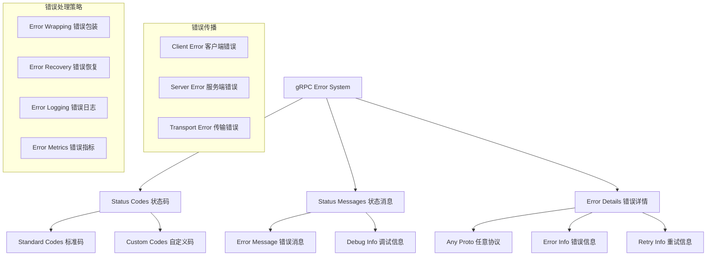
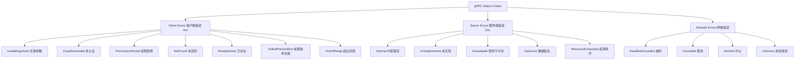

# 状态码和错误处理 (Status & Error Handling) 深度分析

## 📖 概述

gRPC-Go 的错误处理系统基于标准化的状态码体系，提供了丰富的错误信息传递机制。它不仅支持基本的错误码和消息，还支持详细的错误详情，为客户端和服务端之间的错误通信提供了完整的解决方案。

## 🏗️ 核心架构

### 错误处理系统架构



### gRPC 状态码定义

<augment_code_snippet path="codes/codes.go" mode="EXCERPT">
````go
// A Code is an unsigned 32-bit error code as defined in the gRPC spec.
type Code uint32

const (
    // OK is returned on success.
    OK Code = 0
    
    // Cancelled indicates the operation was cancelled (typically by the caller).
    Cancelled Code = 1
    
    // Unknown error.
    Unknown Code = 2
    
    // InvalidArgument indicates client specified an invalid argument.
    InvalidArgument Code = 3
    
    // DeadlineExceeded means operation expired before completion.
    DeadlineExceeded Code = 4
    
    // NotFound means some requested entity (e.g., file or directory) was not found.
    NotFound Code = 5
    
    // AlreadyExists means an attempt to create an entity failed because one already exists.
    AlreadyExists Code = 6
    
    // PermissionDenied indicates the caller does not have permission to execute the specified operation.
    PermissionDenied Code = 7
    
    // ResourceExhausted indicates some resource has been exhausted.
    ResourceExhausted Code = 8
    
    // FailedPrecondition indicates operation was rejected because the system is not in a state required for the operation's execution.
    FailedPrecondition Code = 9
    
    // Aborted indicates the operation was aborted.
    Aborted Code = 10
    
    // OutOfRange means operation was attempted past the valid range.
    OutOfRange Code = 11
    
    // Unimplemented indicates operation is not implemented or not supported/enabled in this service.
    Unimplemented Code = 12
    
    // Internal errors.
    Internal Code = 13
    
    // Unavailable indicates the service is currently unavailable.
    Unavailable Code = 14
    
    // DataLoss indicates unrecoverable data loss or corruption.
    DataLoss Code = 15
    
    // Unauthenticated indicates the request does not have valid authentication credentials.
    Unauthenticated Code = 16
)
````
</augment_code_snippet>

## 🎯 状态码使用指南

### 状态码分类和使用场景



### 状态码选择指南

```go
// 状态码选择示例
func selectStatusCode(err error) codes.Code {
    switch {
    // 客户端错误
    case errors.Is(err, ErrInvalidInput):
        return codes.InvalidArgument
    case errors.Is(err, ErrUnauthorized):
        return codes.Unauthenticated
    case errors.Is(err, ErrForbidden):
        return codes.PermissionDenied
    case errors.Is(err, ErrNotFound):
        return codes.NotFound
    case errors.Is(err, ErrAlreadyExists):
        return codes.AlreadyExists
    case errors.Is(err, ErrPreconditionFailed):
        return codes.FailedPrecondition
    case errors.Is(err, ErrOutOfRange):
        return codes.OutOfRange
        
    // 服务端错误
    case errors.Is(err, ErrInternal):
        return codes.Internal
    case errors.Is(err, ErrNotImplemented):
        return codes.Unimplemented
    case errors.Is(err, ErrServiceUnavailable):
        return codes.Unavailable
    case errors.Is(err, ErrResourceExhausted):
        return codes.ResourceExhausted
    case errors.Is(err, ErrDataLoss):
        return codes.DataLoss
        
    // 网络和系统错误
    case errors.Is(err, context.DeadlineExceeded):
        return codes.DeadlineExceeded
    case errors.Is(err, context.Canceled):
        return codes.Cancelled
        
    default:
        return codes.Unknown
    }
}
```

## 🔧 错误创建和处理

### 1. 基本错误创建

```go
// 创建简单错误
func createBasicErrors() {
    // 使用 status 包创建错误
    err1 := status.Error(codes.InvalidArgument, "invalid user ID")
    err2 := status.Errorf(codes.NotFound, "user %s not found", userID)
    
    // 使用 status.New 创建状态
    st := status.New(codes.PermissionDenied, "access denied")
    err3 := st.Err()
}

// 服务端错误返回
func (s *userService) GetUser(ctx context.Context, req *pb.GetUserRequest) (*pb.User, error) {
    if req.UserId == "" {
        return nil, status.Error(codes.InvalidArgument, "user ID is required")
    }
    
    user, err := s.userRepo.GetUser(ctx, req.UserId)
    if err != nil {
        if errors.Is(err, ErrUserNotFound) {
            return nil, status.Errorf(codes.NotFound, "user %s not found", req.UserId)
        }
        return nil, status.Error(codes.Internal, "failed to get user")
    }
    
    return user, nil
}
```

### 2. 带详情的错误

```go
// 创建带详情的错误
func createDetailedError() error {
    st := status.New(codes.InvalidArgument, "validation failed")
    
    // 添加错误详情
    details := &errdetails.BadRequest{
        FieldViolations: []*errdetails.BadRequest_FieldViolation{
            {
                Field:       "email",
                Description: "invalid email format",
            },
            {
                Field:       "age",
                Description: "age must be between 18 and 100",
            },
        },
    }
    
    st, err := st.WithDetails(details)
    if err != nil {
        return status.Error(codes.Internal, "failed to add error details")
    }
    
    return st.Err()
}

// 添加重试信息
func createRetryableError() error {
    st := status.New(codes.Unavailable, "service temporarily unavailable")
    
    retryInfo := &errdetails.RetryInfo{
        RetryDelay: durationpb.New(time.Second * 30),
    }
    
    st, err := st.WithDetails(retryInfo)
    if err != nil {
        return status.Error(codes.Internal, "failed to add retry info")
    }
    
    return st.Err()
}

// 添加调试信息
func createDebugError() error {
    st := status.New(codes.Internal, "internal server error")
    
    debugInfo := &errdetails.DebugInfo{
        StackEntries: []string{
            "at userService.GetUser (user_service.go:42)",
            "at userHandler.HandleGetUser (user_handler.go:28)",
        },
        Detail: "database connection failed",
    }
    
    st, err := st.WithDetails(debugInfo)
    if err != nil {
        return status.Error(codes.Internal, "failed to add debug info")
    }
    
    return st.Err()
}
```

### 3. 客户端错误处理

```go
// 客户端错误处理
func handleClientError(err error) {
    if err == nil {
        return
    }
    
    // 提取 gRPC 状态
    st, ok := status.FromError(err)
    if !ok {
        log.Printf("Non-gRPC error: %v", err)
        return
    }
    
    // 根据状态码处理
    switch st.Code() {
    case codes.InvalidArgument:
        log.Printf("Invalid argument: %s", st.Message())
        handleValidationError(st)
        
    case codes.NotFound:
        log.Printf("Resource not found: %s", st.Message())
        handleNotFoundError(st)
        
    case codes.Unauthenticated:
        log.Printf("Authentication required: %s", st.Message())
        handleAuthError(st)
        
    case codes.PermissionDenied:
        log.Printf("Permission denied: %s", st.Message())
        handlePermissionError(st)
        
    case codes.DeadlineExceeded:
        log.Printf("Request timeout: %s", st.Message())
        handleTimeoutError(st)
        
    case codes.Unavailable:
        log.Printf("Service unavailable: %s", st.Message())
        handleUnavailableError(st)
        
    case codes.Internal:
        log.Printf("Internal server error: %s", st.Message())
        handleInternalError(st)
        
    default:
        log.Printf("Unexpected error [%s]: %s", st.Code(), st.Message())
    }
}

// 处理验证错误详情
func handleValidationError(st *status.Status) {
    for _, detail := range st.Details() {
        switch d := detail.(type) {
        case *errdetails.BadRequest:
            log.Printf("Validation errors:")
            for _, violation := range d.FieldViolations {
                log.Printf("  Field: %s, Error: %s", violation.Field, violation.Description)
            }
        }
    }
}

// 处理重试错误
func handleUnavailableError(st *status.Status) {
    for _, detail := range st.Details() {
        switch d := detail.(type) {
        case *errdetails.RetryInfo:
            retryDelay := d.RetryDelay.AsDuration()
            log.Printf("Service unavailable, retry after: %v", retryDelay)
            // 实现重试逻辑
            time.Sleep(retryDelay)
        }
    }
}
```

## 🚀 高级错误处理模式

### 1. 错误包装和链式处理

```go
// 错误包装器
type ErrorWrapper struct {
    cause      error
    code       codes.Code
    message    string
    details    []proto.Message
    stackTrace []string
}

func WrapError(err error, code codes.Code, message string) *ErrorWrapper {
    return &ErrorWrapper{
        cause:      err,
        code:       code,
        message:    message,
        stackTrace: captureStackTrace(),
    }
}

func (e *ErrorWrapper) WithDetails(details ...proto.Message) *ErrorWrapper {
    e.details = append(e.details, details...)
    return e
}

func (e *ErrorWrapper) Error() string {
    return fmt.Sprintf("%s: %v", e.message, e.cause)
}

func (e *ErrorWrapper) ToGRPCError() error {
    st := status.New(e.code, e.message)
    
    if len(e.details) > 0 {
        st, _ = st.WithDetails(e.details...)
    }
    
    return st.Err()
}

// 使用示例
func processUser(ctx context.Context, userID string) error {
    user, err := getUserFromDB(ctx, userID)
    if err != nil {
        return WrapError(err, codes.Internal, "failed to get user from database").
            WithDetails(&errdetails.ErrorInfo{
                Reason: "DATABASE_ERROR",
                Domain: "user.service",
            }).ToGRPCError()
    }
    
    if err := validateUser(user); err != nil {
        return WrapError(err, codes.InvalidArgument, "user validation failed").
            ToGRPCError()
    }
    
    return nil
}
```

### 2. 错误恢复和降级

```go
// 错误恢复处理器
type ErrorRecoveryHandler struct {
    fallbackService FallbackService
    circuitBreaker  CircuitBreaker
}

func (h *ErrorRecoveryHandler) HandleWithRecovery(ctx context.Context, 
    operation func() (any, error)) (any, error) {
    
    // 检查熔断器状态
    if h.circuitBreaker.IsOpen() {
        return h.fallbackService.GetFallbackResponse(), 
               status.Error(codes.Unavailable, "service circuit breaker is open")
    }
    
    result, err := operation()
    if err != nil {
        st, ok := status.FromError(err)
        if !ok {
            return nil, err
        }
        
        // 根据错误类型决定是否降级
        switch st.Code() {
        case codes.Unavailable, codes.DeadlineExceeded, codes.ResourceExhausted:
            h.circuitBreaker.RecordFailure()
            
            // 尝试降级服务
            if fallbackResult := h.fallbackService.GetFallbackResponse(); fallbackResult != nil {
                log.Printf("Using fallback response due to error: %v", err)
                return fallbackResult, nil
            }
            
        case codes.Internal:
            h.circuitBreaker.RecordFailure()
            
        default:
            // 客户端错误不影响熔断器
        }
        
        return nil, err
    }
    
    h.circuitBreaker.RecordSuccess()
    return result, nil
}
```

### 3. 错误聚合和批处理

```go
// 错误聚合器
type ErrorAggregator struct {
    errors []error
    mu     sync.Mutex
}

func NewErrorAggregator() *ErrorAggregator {
    return &ErrorAggregator{}
}

func (a *ErrorAggregator) Add(err error) {
    if err == nil {
        return
    }
    
    a.mu.Lock()
    defer a.mu.Unlock()
    a.errors = append(a.errors, err)
}

func (a *ErrorAggregator) ToGRPCError() error {
    a.mu.Lock()
    defer a.mu.Unlock()
    
    if len(a.errors) == 0 {
        return nil
    }
    
    if len(a.errors) == 1 {
        return a.errors[0]
    }
    
    // 创建聚合错误
    st := status.New(codes.InvalidArgument, "multiple validation errors")
    
    var violations []*errdetails.BadRequest_FieldViolation
    for i, err := range a.errors {
        if grpcErr, ok := status.FromError(err); ok {
            for _, detail := range grpcErr.Details() {
                if badReq, ok := detail.(*errdetails.BadRequest); ok {
                    violations = append(violations, badReq.FieldViolations...)
                }
            }
        } else {
            violations = append(violations, &errdetails.BadRequest_FieldViolation{
                Field:       fmt.Sprintf("error_%d", i),
                Description: err.Error(),
            })
        }
    }
    
    if len(violations) > 0 {
        badRequest := &errdetails.BadRequest{
            FieldViolations: violations,
        }
        st, _ = st.WithDetails(badRequest)
    }
    
    return st.Err()
}

// 批量验证示例
func validateUserBatch(users []*pb.User) error {
    aggregator := NewErrorAggregator()
    
    for i, user := range users {
        if err := validateUser(user); err != nil {
            wrappedErr := status.Errorf(codes.InvalidArgument, "user[%d]: %v", i, err)
            aggregator.Add(wrappedErr)
        }
    }
    
    return aggregator.ToGRPCError()
}
```

## 💡 最佳实践

### 1. 错误码映射

```go
// 业务错误到 gRPC 状态码的映射
var errorCodeMap = map[error]codes.Code{
    ErrUserNotFound:        codes.NotFound,
    ErrInvalidEmail:        codes.InvalidArgument,
    ErrUnauthorized:        codes.Unauthenticated,
    ErrForbidden:          codes.PermissionDenied,
    ErrUserAlreadyExists:  codes.AlreadyExists,
    ErrDatabaseConnection: codes.Unavailable,
    ErrRateLimitExceeded:  codes.ResourceExhausted,
}

// 统一错误转换
func toGRPCError(err error) error {
    if err == nil {
        return nil
    }
    
    // 检查是否已经是 gRPC 错误
    if _, ok := status.FromError(err); ok {
        return err
    }
    
    // 映射业务错误
    for businessErr, grpcCode := range errorCodeMap {
        if errors.Is(err, businessErr) {
            return status.Error(grpcCode, err.Error())
        }
    }
    
    // 默认为内部错误
    return status.Error(codes.Internal, "internal server error")
}
```

### 2. 错误日志记录

```go
// 结构化错误日志
func logGRPCError(method string, err error) {
    if err == nil {
        return
    }
    
    st, ok := status.FromError(err)
    if !ok {
        log.Printf("Non-gRPC error in %s: %v", method, err)
        return
    }
    
    logEntry := map[string]any{
        "method":     method,
        "code":       st.Code().String(),
        "message":    st.Message(),
        "timestamp":  time.Now().Unix(),
    }
    
    // 添加错误详情
    if len(st.Details()) > 0 {
        details := make([]map[string]any, 0, len(st.Details()))
        for _, detail := range st.Details() {
            details = append(details, map[string]any{
                "type": fmt.Sprintf("%T", detail),
                "data": detail,
            })
        }
        logEntry["details"] = details
    }
    
    // 根据错误级别记录日志
    switch st.Code() {
    case codes.Internal, codes.DataLoss:
        log.Printf("ERROR: %+v", logEntry)
    case codes.Unavailable, codes.DeadlineExceeded:
        log.Printf("WARN: %+v", logEntry)
    default:
        log.Printf("INFO: %+v", logEntry)
    }
}
```

### 3. 错误指标收集

```go
// 错误指标收集
var (
    errorCounter = prometheus.NewCounterVec(
        prometheus.CounterOpts{
            Name: "grpc_errors_total",
            Help: "Total number of gRPC errors",
        },
        []string{"method", "code"},
    )
)

func recordErrorMetrics(method string, err error) {
    if err == nil {
        return
    }
    
    code := codes.Unknown.String()
    if st, ok := status.FromError(err); ok {
        code = st.Code().String()
    }
    
    errorCounter.WithLabelValues(method, code).Inc()
}
```

---

gRPC-Go 的状态码和错误处理系统提供了标准化的错误通信机制，理解其设计和最佳实践对于构建健壮的 gRPC 应用至关重要。
