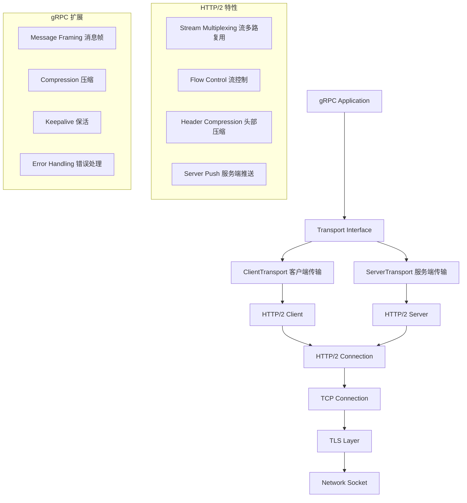
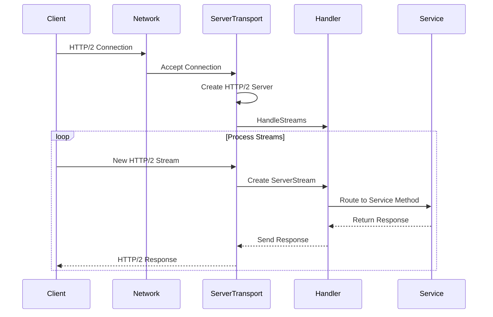
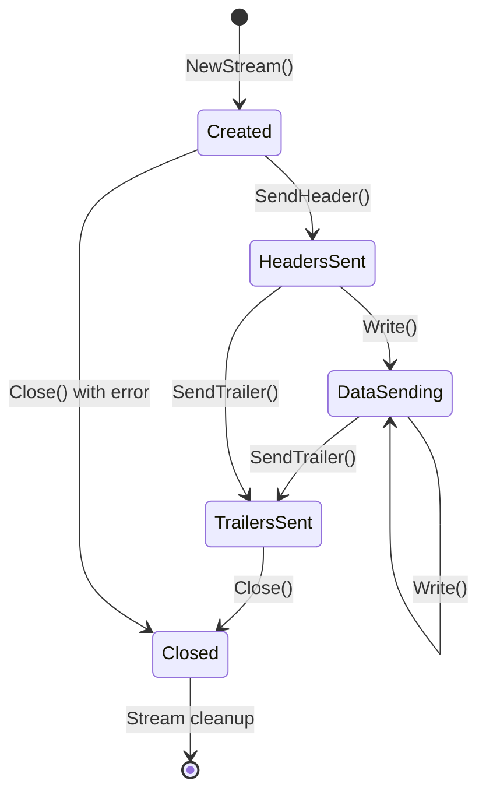
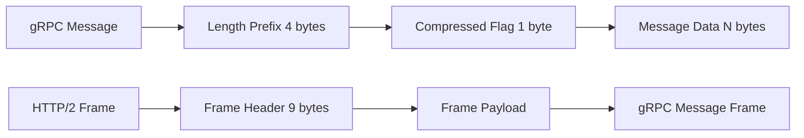
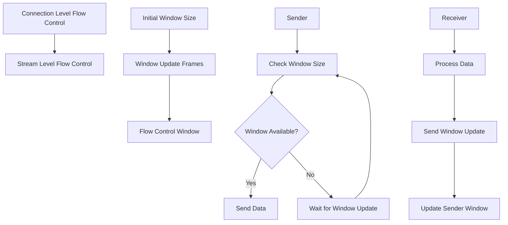
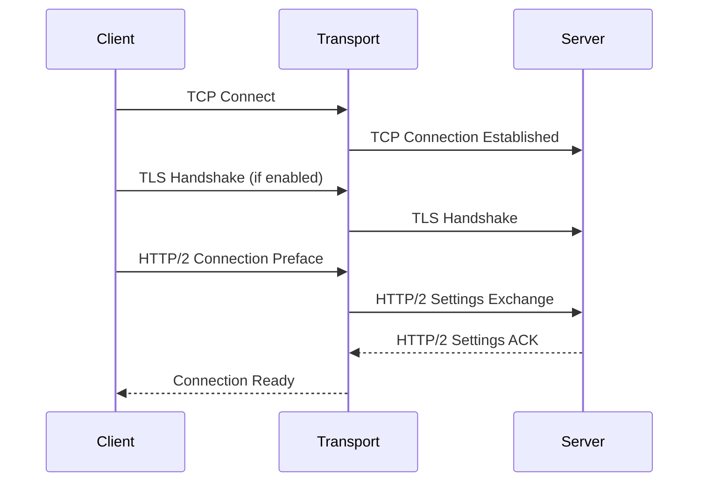

# 传输层实现 (Transport Layer) 深度分析

## 📖 概述

gRPC-Go 的传输层基于 HTTP/2 协议实现，提供了高效的多路复用、流控制、头部压缩等特性。传输层抽象了底层网络通信细节，为上层提供了统一的流式 RPC 通信接口。

## 🏗️ 核心架构

### 传输层组件架构



### 关键接口定义

<augment_code_snippet path="internal/transport/transport.go" mode="EXCERPT">
````go
// ClientTransport is the common interface for all gRPC client-side transport implementations.
type ClientTransport interface {
    // Close tears down this transport
    Close(err error)
    // GracefulClose starts to tear down the transport
    GracefulClose()
    // NewStream creates a Stream for an RPC
    NewStream(ctx context.Context, callHdr *CallHdr) (*ClientStream, error)
    // Error returns a channel that is closed when some I/O error happens
    Error() <-chan struct{}
    // GoAway returns a channel that is closed when ClientTransport receives the draining signal
    GoAway() <-chan struct{}
    // RemoteAddr returns the remote network address
    RemoteAddr() net.Addr
}

// ServerTransport is the common interface for all gRPC server-side transport implementations.
type ServerTransport interface {
    // HandleStreams receives incoming streams using the given handler
    HandleStreams(context.Context, func(*ServerStream))
    // Close tears down the transport
    Close(err error)
    // Peer returns the peer of the server transport
    Peer() *peer.Peer
    // Drain notifies the client this ServerTransport stops accepting new RPCs
    Drain(debugData string)
}
````
</augment_code_snippet>

## 🔄 HTTP/2 传输实现

### 客户端传输 (HTTP/2 Client)

<augment_code_snippet path="internal/transport/http2_client.go" mode="EXCERPT">
````go
// http2Client implements the ClientTransport interface with HTTP2.
type http2Client struct {
    lastRead  int64 // Keep this field 64-bit aligned. Accessed atomically.
    ctx       context.Context
    cancel    context.CancelFunc
    ctxDone   <-chan struct{} // Cache the ctx.Done() chan.
    userAgent string
    
    conn       net.Conn // underlying communication channel
    loopy      *loopyWriter
    remoteAddr net.Addr
    localAddr  net.Addr
    authInfo   credentials.AuthInfo // auth info about the connection
}
````
</augment_code_snippet>

**核心功能：**
- HTTP/2 连接管理
- 流的创建和管理
- 消息帧的发送和接收
- 流控制和错误处理

### 服务端传输 (HTTP/2 Server)



## 🎯 流管理机制

### 客户端流 (ClientStream)

<augment_code_snippet path="internal/transport/client_stream.go" mode="EXCERPT">
````go
// ClientStream represents a client-side stream.
type ClientStream struct {
    *Stream
    ct     ClientTransport
    status *status.Status // the status error received from the server
}

// Read reads an n byte message from the input stream.
func (s *ClientStream) Read(n int) (mem.BufferSlice, error) {
    b, err := s.Stream.read(n)
    if err == nil {
        s.ct.incrMsgRecv()
    }
    return b, err
}

// Write writes the hdr and data bytes to the output stream.
func (s *ClientStream) Write(hdr []byte, data mem.BufferSlice, opts *WriteOptions) error {
    return s.ct.write(s, hdr, data, opts)
}
````
</augment_code_snippet>

### 服务端流 (ServerStream)

```go
// ServerStream represents a server-side stream.
type ServerStream struct {
    *Stream
    st ServerTransport
    method string // RPC method name
}
```

### 流状态管理



## 🔧 消息帧处理

### gRPC 消息帧格式



### 消息编码和解码

```go
// 消息帧编码
func encodeGRPCMessage(msg []byte, compressed bool) []byte {
    frame := make([]byte, 5+len(msg))
    
    // Length prefix (4 bytes)
    binary.BigEndian.PutUint32(frame[:4], uint32(len(msg)))
    
    // Compressed flag (1 byte)
    if compressed {
        frame[4] = 1
    } else {
        frame[4] = 0
    }
    
    // Message data
    copy(frame[5:], msg)
    return frame
}

// 消息帧解码
func decodeGRPCMessage(frame []byte) ([]byte, bool, error) {
    if len(frame) < 5 {
        return nil, false, errors.New("invalid frame length")
    }
    
    // 读取长度前缀
    length := binary.BigEndian.Uint32(frame[:4])
    
    // 读取压缩标志
    compressed := frame[4] == 1
    
    // 读取消息数据
    if len(frame) < int(5+length) {
        return nil, false, errors.New("incomplete message")
    }
    
    return frame[5:5+length], compressed, nil
}
```

## ⚙️ 流控制机制

### HTTP/2 流控制



### 流控制实现

```go
// 流控制窗口管理
type flowControlWindow struct {
    size   int32
    limit  int32
    mu     sync.Mutex
}

func (w *flowControlWindow) consume(n int32) bool {
    w.mu.Lock()
    defer w.mu.Unlock()
    
    if w.size < n {
        return false // 窗口不足
    }
    
    w.size -= n
    return true
}

func (w *flowControlWindow) update(n int32) {
    w.mu.Lock()
    defer w.mu.Unlock()
    
    w.size += n
    if w.size > w.limit {
        w.size = w.limit
    }
}
```

## 🔒 连接管理

### 连接建立流程



### Keepalive 机制

```go
// Keepalive 配置
type KeepaliveConfig struct {
    Time                time.Duration // 发送 ping 的间隔
    Timeout             time.Duration // ping 超时时间
    PermitWithoutStream bool          // 是否允许在没有活跃流时发送 ping
}

// Keepalive 实现
func (t *http2Client) keepalive() {
    ticker := time.NewTicker(t.kp.Time)
    defer ticker.Stop()
    
    for {
        select {
        case <-ticker.C:
            if t.shouldSendKeepalive() {
                t.sendPing()
            }
        case <-t.ctx.Done():
            return
        }
    }
}
```

## 🚀 性能优化特性

### 1. 零拷贝优化

```go
// 使用 mem.BufferSlice 实现零拷贝
type BufferSlice interface {
    Len() int
    // MaterializeToBuffer 将数据物化到缓冲区
    MaterializeToBuffer([]byte) []byte
    // CopyTo 复制数据到目标
    CopyTo([]byte) int
}

// 零拷贝写入
func (s *ClientStream) writeZeroCopy(data mem.BufferSlice) error {
    // 直接使用 BufferSlice，避免内存拷贝
    return s.ct.writeBufferSlice(s, data)
}
```

### 2. 连接复用

```go
// HTTP/2 连接复用管理
type connectionPool struct {
    connections map[string]*http2Client
    mu          sync.RWMutex
    maxStreams  int
}

func (p *connectionPool) getConnection(addr string) *http2Client {
    p.mu.RLock()
    conn, exists := p.connections[addr]
    p.mu.RUnlock()
    
    if exists && conn.canCreateStream() {
        return conn
    }
    
    // 创建新连接或等待现有连接可用
    return p.createOrWaitConnection(addr)
}
```

### 3. 批量处理

```go
// 批量发送优化
type batchWriter struct {
    transport *http2Client
    buffer    []writeRequest
    timer     *time.Timer
}

func (w *batchWriter) write(req writeRequest) {
    w.buffer = append(w.buffer, req)
    
    if len(w.buffer) >= batchSize || w.timer == nil {
        w.flush()
    } else if w.timer == nil {
        w.timer = time.AfterFunc(batchTimeout, w.flush)
    }
}

func (w *batchWriter) flush() {
    if len(w.buffer) == 0 {
        return
    }
    
    // 批量发送所有请求
    w.transport.batchWrite(w.buffer)
    w.buffer = w.buffer[:0]
    
    if w.timer != nil {
        w.timer.Stop()
        w.timer = nil
    }
}
```

## 🔍 错误处理和恢复

### 传输层错误处理

```go
// 传输层错误类型
type TransportError struct {
    Code        codes.Code
    Description string
    Temporary   bool
}

// 错误处理策略
func (t *http2Client) handleError(err error) {
    switch e := err.(type) {
    case *TransportError:
        if e.Temporary {
            // 临时错误，尝试重连
            t.reconnect()
        } else {
            // 永久错误，关闭连接
            t.Close(err)
        }
    case net.Error:
        if e.Timeout() {
            // 超时错误处理
            t.handleTimeout()
        } else {
            // 网络错误处理
            t.handleNetworkError(e)
        }
    default:
        // 未知错误，关闭连接
        t.Close(err)
    }
}
```

### 连接恢复机制

```go
// 自动重连实现
func (t *http2Client) reconnect() {
    backoff := t.backoffConfig.Initial
    
    for attempt := 0; attempt < t.maxRetries; attempt++ {
        time.Sleep(backoff)
        
        if err := t.connect(); err == nil {
            // 重连成功
            t.notifyReconnected()
            return
        }
        
        // 指数退避
        backoff = min(backoff*2, t.backoffConfig.Max)
    }
    
    // 重连失败，关闭传输
    t.Close(errors.New("max reconnection attempts exceeded"))
}
```

## 💡 最佳实践

### 1. 连接配置优化

```go
// 生产环境推荐配置
func createOptimizedTransport() grpc.DialOption {
    return grpc.WithTransportCredentials(
        credentials.NewTLS(&tls.Config{
            ServerName: "your-service.com",
        }),
    )
}

// HTTP/2 参数调优
func configureHTTP2() grpc.DialOption {
    return grpc.WithDefaultCallOptions(
        grpc.MaxCallRecvMsgSize(4*1024*1024),  // 4MB
        grpc.MaxCallSendMsgSize(4*1024*1024),  // 4MB
    )
}
```

### 2. 流控制调优

```go
// 流控制窗口大小调优
const (
    defaultWindowSize     = 64 * 1024      // 64KB
    largeWindowSize      = 1024 * 1024     // 1MB
    connectionWindowSize = 16 * 1024 * 1024 // 16MB
)

func configureFlowControl() {
    // 根据网络条件和应用特性调整窗口大小
    if isHighBandwidthNetwork() {
        setWindowSize(largeWindowSize)
    } else {
        setWindowSize(defaultWindowSize)
    }
}
```

### 3. 监控和调试

```go
// 传输层指标收集
type TransportMetrics struct {
    ConnectionsActive   int64
    StreamsActive      int64
    BytesSent          int64
    BytesReceived      int64
    ErrorsTotal        int64
}

func (t *http2Client) recordMetrics() {
    metrics.ConnectionsActive.Set(float64(t.activeConnections))
    metrics.StreamsActive.Set(float64(t.activeStreams))
    metrics.BytesSent.Add(float64(t.bytesSent))
    metrics.BytesReceived.Add(float64(t.bytesReceived))
}
```

---

gRPC-Go 的传输层实现提供了高效、可靠的 HTTP/2 通信能力，理解其架构和优化策略对于构建高性能的 gRPC 应用至关重要。
